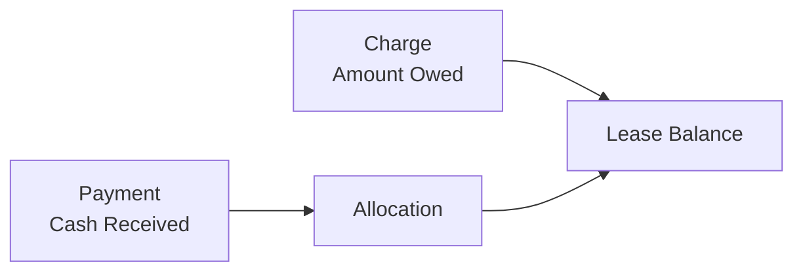
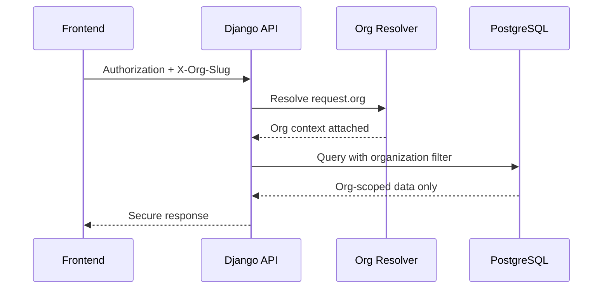
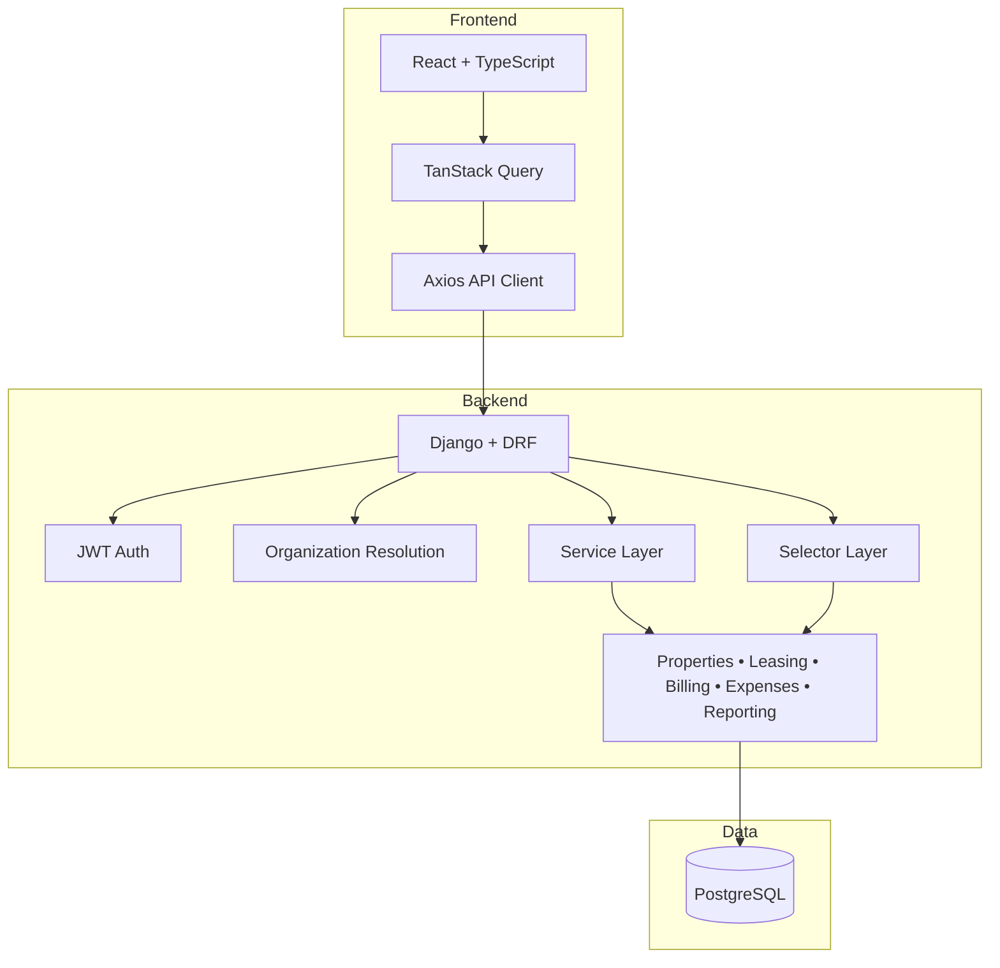
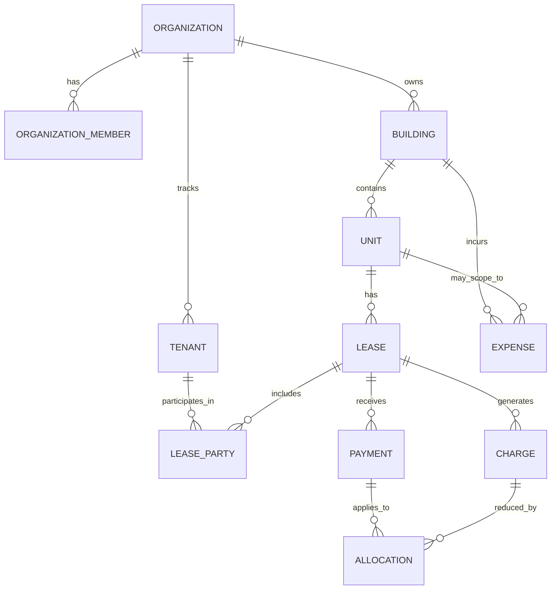

# EstateIQ

### AI-Native Financial Operating System for Small Real Estate Portfolios

**Made in America. Built for the owners who keep American housing running.**

---

## Executive Summary

EstateIQ is a multi-tenant, AI-native financial operating system for small real estate portfolio owners managing roughly **1–50 units**.

This is **not** a tenant portal-first rent app.

It is a **ledger-first financial control system** designed to help small landlords answer the questions that actually matter:

- What am I owed right now?
- What has been paid, and how was it applied?
- Which tenants or leases are delinquent?
- Which buildings are performing well or poorly?
- Where is money leaking out of the portfolio?

EstateIQ combines:

- deterministic accounting logic
- strict organization-level tenant isolation
- lease-scoped receivables tracking
- structured operational data
- an AI interpretation layer grounded in real portfolio numbers

The result is a platform that turns fragmented rental operations into **structured, explainable financial control**.

---

## The Problem

Small landlords often operate in the gap between two bad software categories:

### 1. Property management tools
These usually optimize for collection workflows, messaging, and tenant UX.
They are often weak at rigorous financial modeling.

### 2. Generic accounting software
These tools can track money, but they are disconnected from the operational reality of leasing, unit turnover, rent obligations, and delinquency.

That leaves small portfolio owners with a familiar mess:

- spreadsheet accounting
- weak delinquency visibility
- manual rent tracking
- poor portfolio-level reporting
- financial workflows disconnected from lease truth
- high risk of silent errors across tenants, leases, and properties

For small landlords, the issue is not just inconvenience.
It is **financial uncertainty**.

---

## The Solution

EstateIQ is built as a financial operating system with three core pillars.

### 1. Ledger-First Accounting

EstateIQ treats billing as a deterministic receivables ledger.

- **Charges** create obligations owed
- **Payments** represent money actually received
- **Allocations** show exactly how payments were applied
- balances are **derived from ledger history**, not guessed from mutable fields

This creates a financial system that is:

- auditable
- mathematically explainable
- resilient to partial payments
- suitable for reporting, delinquency logic, and future AI analysis

---

### 2. Strict Multi-Tenant Isolation

EstateIQ is designed as a true SaaS platform.

**Organization = tenant boundary**

Every landlord business operates inside its own isolated organization scope.
All portfolio, lease, expense, and billing data is resolved within that boundary.

This is important not just for security, but for trust.
Cross-tenant leakage is unacceptable in financial software.

---

### 3. AI on Top of Financial Truth

EstateIQ is AI-native, but the AI does not replace core accounting logic.

AI sits on top of structured, verified portfolio data and explains what the system already knows.

It can eventually help users understand:

- delinquency risk
- expense anomalies
- building underperformance
- portfolio health trends
- rent change scenarios
- cash flow pressure points

This keeps AI explainable, reproducible, and grounded in deterministic ledger data.

---

## Why This Product Wins

EstateIQ is not trying to be a generic all-in-one property tool.
It is winning from the financial core outward.

### Key product advantages

- **Lease-scoped receivables model** instead of vague rent status flags
- **Derived balances** instead of mutable accounting shortcuts
- **Organization-scoped architecture** from day one
- **Operational context tied to financial truth**
- **AI layer grounded in structured portfolio data**
- **Designed specifically for 1–50 unit owners**, an underserved market segment

That creates a stronger product foundation for:

- trust
- retention
- future reporting depth
- decision-support features
- defensibility over time

---

## System Architecture

EstateIQ is being built as a **modular monolith** with clean domain boundaries.
That is the right architecture for speed, correctness, and future extraction.

### Current architecture principles

- modular monolith backend
- service-layer business logic
- thin API views
- deterministic ledger-first financial design
- organization-scoped data enforcement
- AI-ready structured data model

---

## Core Data Model

EstateIQ models the real-world structure of a rental business and ties financial activity to the lease where obligations actually live.

This matters because rent is not fundamentally a building event.
It is a **lease obligation**.

That choice keeps delinquency, ledger views, payment application, and reporting explainable.

---

## Product Surface

EstateIQ is being built around a practical sequence of value:

### Foundation domains
- organizations and membership
- buildings and units
- tenants and leases
- lease-driven occupancy truth

### Financial domains
- billing ledger: charges, payments, allocations
- expenses and expense reporting
- portfolio and building-level reporting

### Intelligence layer
- delinquency monitoring
- anomaly detection
- executive summaries
- scenario analysis

This sequencing matters.
The AI layer becomes valuable **because the system first creates clean financial data**.

---

## Market Opportunity

EstateIQ targets a large, overlooked segment:

- small to mid-size landlords
- family-owned portfolios
- owner-operators with 1–50 units
- small LLC-managed real estate businesses

These users are often:

- too operationally complex for spreadsheets
- too small for enterprise real estate systems
- poorly served by rent-collection-first software

They need clarity, not feature bloat.

---

## Go-To-Market Logic

The initial go-to-market path is straightforward.

### Early wedge
Start with small landlords who already feel financial pain:

- owners managing properties themselves
- families operating a handful of buildings
- operators with inconsistent rent tracking
- landlords who know they are missing financial visibility

### Why the wedge works
EstateIQ does not require replacing every workflow on day one.
It can become valuable by answering a small number of mission-critical questions well:

- who owes what?
- what was actually paid?
- where is the portfolio underperforming?
- what expenses are dragging returns?

That makes the product easier to explain, easier to pilot, and easier to expand over time.

---

## Roadmap

### Phase 1 — Structured Financial Control
- buildings, units, tenants, leases
- expense tracking and expense reporting
- lease-scoped billing ledger
- delinquency visibility
- portfolio dashboard foundations

### Phase 2 — Structured Intelligence
- monthly financial summaries
- risk and anomaly highlighting
- portfolio health scoring
- operational alerts and reminders

### Phase 3 — AI Reasoning and Simulation
- rent increase scenarios
- vacancy stress analysis
- underperforming building identification
- predictive delinquency and optimization insights

---

## Long-Term Vision

EstateIQ becomes:

- the financial operating system for small landlords
- the intelligence layer for real estate portfolios
- a defensible AI-native SaaS company built on deterministic financial infrastructure

The long-term moat is not “AI for property management.”

The moat is:

- structured portfolio data
- financially correct system design
- operational context tied to real numbers
- explainable AI on top of trusted ledger truth

---

## Closing

EstateIQ is being built as a production-grade, multi-tenant SaaS platform with deterministic financial architecture, lease-scoped ledger design, and an AI interpretation layer grounded in structured truth.

**Made in America. Built to give small portfolio owners the financial clarity larger operators already enjoy.**
