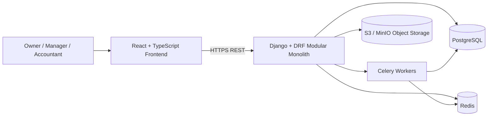
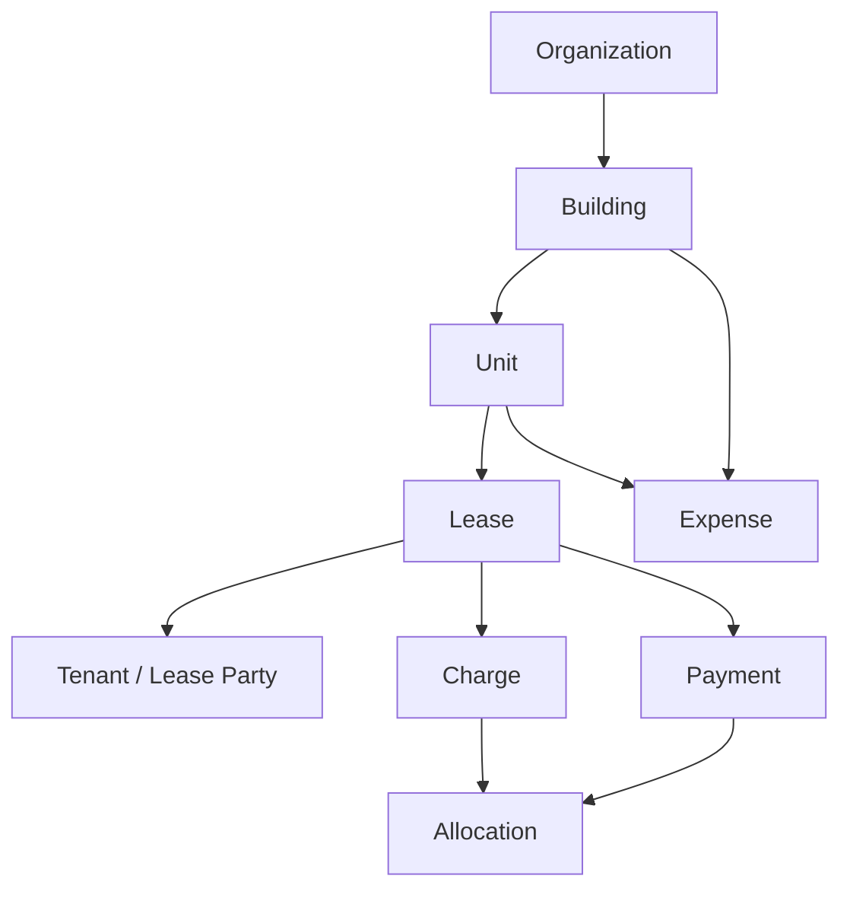
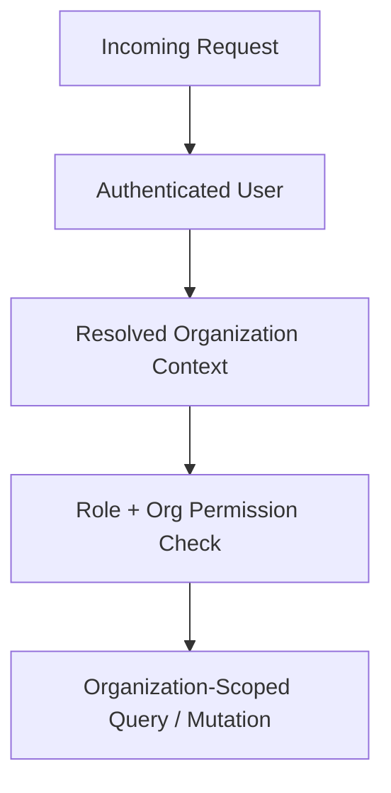
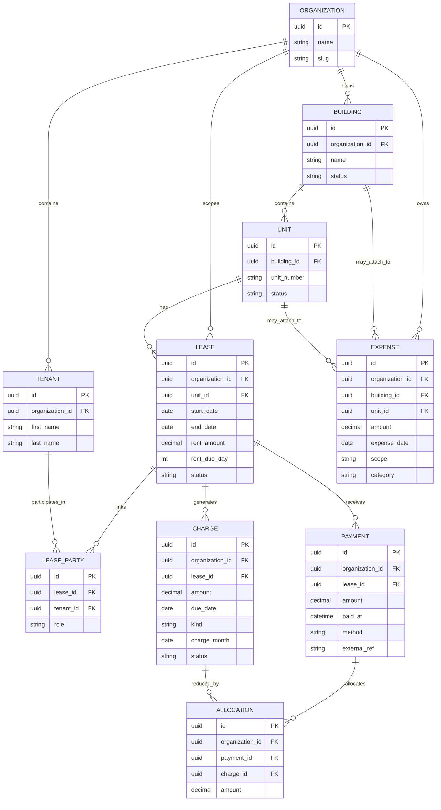
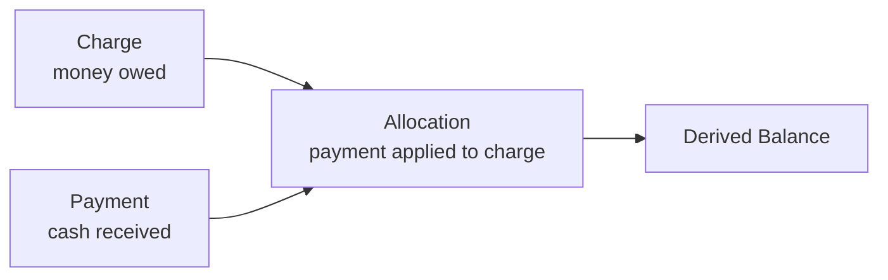
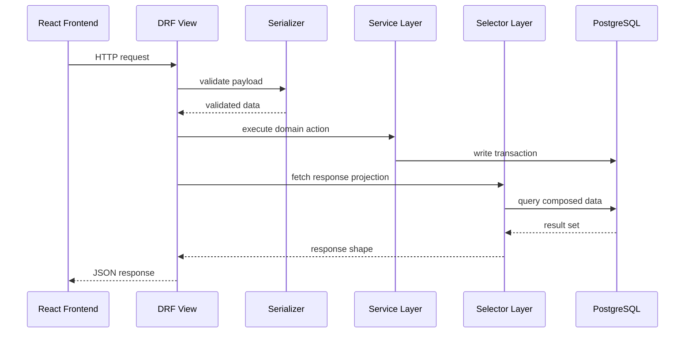

# EstateIQ — Project Architecture

EstateIQ is a multi-tenant **Financial Operating System** for small real estate portfolios.

It is being designed as a **ledger-first, organization-scoped, production-grade SaaS platform** that helps small landlords manage buildings, units, leases, tenants, expenses, and rent receivables with financial clarity.

This document explains the current architectural direction of the system and the principles driving its implementation.

---

# 1. Architecture Goals

EstateIQ is not being built as a generic property management app.

The platform is being shaped around five core goals:

1. **Financial clarity over superficial convenience**
2. **Deterministic, auditable data over hidden automation**
3. **Strong tenant isolation from day one**
4. **Modular backend boundaries that can scale with the product**
5. **Structured data that can support future AI insight layers safely**

---

# 2. High-Level System Overview



## What this means

- The **frontend** provides the operational UI for managing portfolio data.
- The **backend** is a modular monolith responsible for domain logic, validation, permissions, and API contracts.
- **PostgreSQL** stores the source of truth.
- **Redis** supports caching, task coordination, and future background/event patterns.
- **Celery** handles background work such as reporting jobs and future scheduled financial operations.
- **Object storage** is used for receipts, documents, and generated artifacts.

---

# 3. Product-Centric Domain Model

EstateIQ models the real-world ownership and rental relationship of small real estate portfolios.



## Core ownership truth

The system is intentionally built around this path:

```text
Organization → Building → Unit → Lease
```

That path governs both:

- operational data ownership
- financial data ownership

This matters because the platform does **not** treat billing as a generic property event.

Rent receivables belong to the **lease**, not directly to the building or unit.

---

# 4. Modular Monolith Backend

The backend is being designed as a **modular monolith**.

This is the correct route for the current stage of EstateIQ because it preserves:

- transactional simplicity
- fast development speed
- strong domain boundaries
- easier testing
- future extraction paths if specific domains grow large enough

## Domain shape

```text
backend/
  apps/
    organizations/
    buildings/
    units/
    tenants/
    leases/
    expenses/
    billing/
    reporting/
    audit/
    integrations/
  core/
  api/
```

## Design principles inside the monolith

- views stay thin
- serializers define request/response contracts
- services contain business logic
- selectors handle read/query composition
- permissions enforce organization scope
- money math stays deterministic and auditable

---

# 5. Organization-Scoped Multi-Tenancy

Every meaningful record in EstateIQ belongs to an **Organization** boundary.



## Multi-tenant enforcement strategy

Organization isolation is enforced through:

- organization-linked models
- request-level organization resolution
- queryset filtering by organization
- permission checks on every sensitive endpoint
- service-layer validation for cross-object relationships
- test coverage for cross-org leakage prevention

This is foundational because a financial SaaS cannot tolerate loose tenant boundaries.

---

# 6. Core Entity Relationship Diagram



## Important modeling decision

The billing path is intentionally:

```text
Organization → Building → Unit → Lease → Charge / Payment / Allocation
```

That means:

- charges belong to leases
- payments belong to leases
- allocations connect payments to charges
- balances are derived from the ledger

This keeps receivables tied to the actual rental obligation.

---

# 7. Lease-Driven Occupancy Model

EstateIQ does not treat occupancy as a manually toggled truth field.

A unit is occupied because of an active lease, not because someone flipped a boolean.

## Occupancy rule

```text
occupied if:
lease.start_date <= today
and
(lease.end_date is null or lease.end_date >= today)
```

## Why this matters

This prevents drift between:

- unit status
- lease status
- tenant display state
- ledger eligibility

It also keeps the system aligned with real contractual occupancy instead of UI-managed state.

---

# 8. Ledger-First Financial Architecture

EstateIQ uses a **ledger-first** model for receivables.



## Financial truth model

```text
Lease Balance = SUM(charges) - SUM(allocations)
```

## Why balance is derived instead of stored

This gives the platform:

- immutable financial history
- support for partial payments
- support for one-to-many and many-to-one payment application
- clean auditability
- deterministic reporting
- safer future AI explanations

## What the system avoids on purpose

- no mutable stored lease balance as source of truth
- no fake paid/unpaid booleans as accounting truth
- no hidden money math inside controllers
- no destructive rewrites of financial history

---

# 9. Billing Domain Direction

The billing domain is being built as an **accounts receivable subledger**, not a tenant-facing payment portal.

## Current billing philosophy

The correct interpretation of billing in EstateIQ is:

- **Charge** = obligation owed
- **Payment** = cash already received
- **Allocation** = how payment reduces what is owed

## Current implementation direction

Phase A is centered on:

- lease-scoped charges
- owner/manager-entered payments
- allocation logic
- ledger views
- delinquency logic
- internal operational alerting

## Deliberate MVP stance

The platform is being designed as:

**deterministic but explicit**

not

**automatic and assumptive**

That means monthly rent generation can be manual and idempotent first, instead of silently posting financial records behind the scenes.

---

# 10. Expense Domain Architecture

Expenses are a separate financial domain from billing.

That separation is important.

## Expense scope

Expenses may be associated with:

- organization-level operations
- building-level spend
- unit-level spend
- vendor-linked activity where relevant

## Why expenses stay separate from billing

Receivables and spend are different economic truths:

- billing answers: **what is owed and what was collected**
- expenses answer: **what was spent and where**

This separation improves reporting, maintainability, and future analytics.

---

# 11. API and Request Flow

EstateIQ follows a service-layer request lifecycle.



## Why this matters

This architecture keeps responsibilities separate:

- **views** orchestrate request/response flow
- **serializers** validate contracts
- **services** apply domain rules
- **selectors** build rich read models

That is the right pattern for a system with complex business rules and financial reporting needs.

---

# 12. Frontend Architecture

The frontend is a React + TypeScript application built for operational clarity.

## Frontend responsibilities

- render building, unit, lease, tenant, and expense workflows
- show lease ledger and financial state clearly
- provide mutation workflows through typed API calls
- separate server state from view state
- support future AI insight surfaces without confusing deterministic math with AI commentary

## Frontend stack

- React
- TypeScript
- Axios
- TanStack Query
- Tailwind CSS

## Frontend shape

```text
frontend/
  src/
    app/
    components/
    features/
    api/
    auth/
    providers/
    layouts/
    routes/
```

---

# 13. Background Jobs and Asynchronous Work

Some system responsibilities are better handled outside the request cycle.

## Current / planned background job responsibilities

- future scheduled rent generation where policy allows
- delinquency calculations and queue building
- notification digest generation
- report generation
- document processing
- future analytical projections

## Why Celery exists here

Celery allows the platform to separate:

- interactive user actions
- slow or scheduled operational work

That keeps the UI responsive while preserving deterministic backend control.

---

# 14. Security Architecture

Security is built into the system architecture, not added later.

## Security principles

- strict tenant isolation
- least privilege permissions
- authenticated request boundary
- server-side organization enforcement
- auditable mutations for sensitive financial actions
- secure file handling
- HTTPS-only production deployment

## Role direction

The system can support roles such as:

- owner
- manager
- accountant
- read-only

Role design can evolve, but the underlying rule stays the same:

**every action is constrained by both role and organization boundary**

---

# 15. Scalability Strategy

EstateIQ is intentionally starting as a modular monolith.

That is not a compromise. It is the right engineering choice for the current stage.

## Phase 1

- modular monolith
- strong domain boundaries
- shared transactional integrity
- fast development velocity

## Phase 2

- improve read models and reporting projections
- add stronger background processing patterns
- expand observability and audit tooling

## Phase 3

- extract specific domains only if justified
- add read replicas if load demands it
- add projection/event pipelines if reporting complexity requires it
- scale horizontally where necessary

The rule is simple:

**do not pay distributed-systems complexity before the product earns it**

---

# 16. AI-Readiness Without AI Gimmicks

EstateIQ is being designed so future AI features can sit on top of structured financial truth.

## That requires

- deterministic ledger data
- reproducible calculations
- rich read models
- clear separation between business logic and explanation layers
- auditability of key financial state

## This means AI should eventually

- explain trends
- summarize portfolio status
- highlight anomalies
- clarify delinquency
- compare buildings or periods using real portfolio data

But AI should **not** replace core accounting logic.

---

# 17. Long-Term Platform Direction

EstateIQ is being built to become:

> the financial command center for small landlords

Not just a rent tracker.

Not just a CRUD app.

Not just another generic property tool.

The long-term value of the architecture is that it creates:

- trustworthy financial data
- clear operational workflows
- scalable domain boundaries
- future-ready reporting and AI insight infrastructure

---

# 18. Summary

EstateIQ is currently best understood as a platform with these defining characteristics:

- **multi-tenant by design**
- **organization-scoped everywhere**
- **lease-driven occupancy**
- **ledger-first receivables architecture**
- **separate financial domains for billing and expenses**
- **service/selector backend discipline**
- **modular monolith scalability path**
- **AI-ready because the data model is structured first**

That combination is what makes the system enterprise-grade in direction, while still practical for the product stage it is in today.
