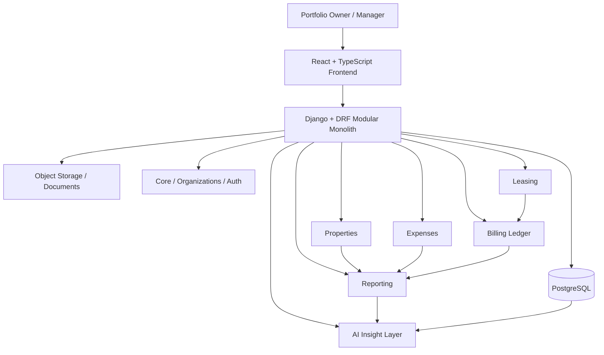
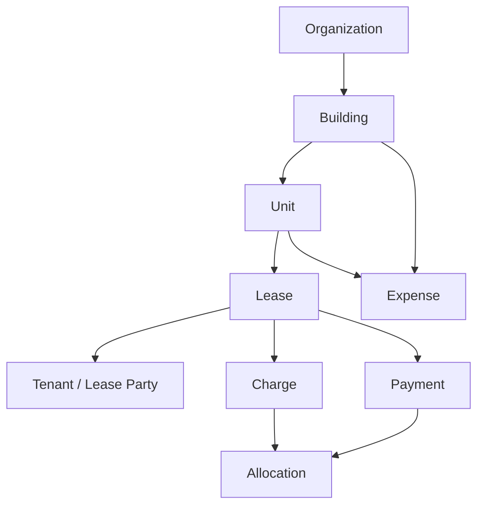
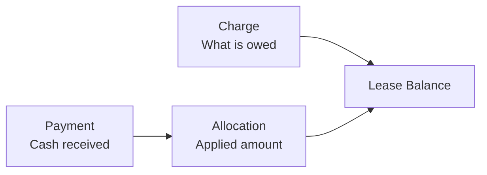
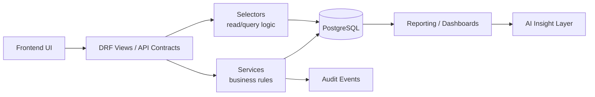
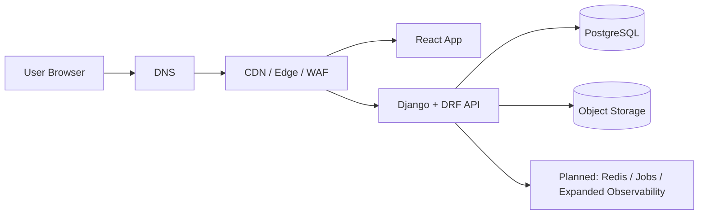
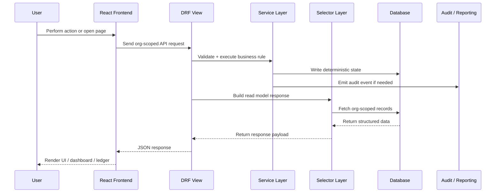

# EstateIQ

**AI-native Financial Operating System for Small Real Estate Portfolios**

Built by **Anthony Narine**  
Made in America.

---

## What this project is

EstateIQ is a finance-first platform for small real estate portfolio owners.

It is not a rent tracker.  
It is not a lightweight property directory.  
It is not built around tenant self-service first.

It is being designed as a **financial operating system** where the core system produces structured, reliable portfolio data and AI sits on top of that data to explain risk, performance, delinquency, and portfolio health.

The target user is the small landlord or operator who needs institutional-grade financial clarity without enterprise software bloat.

---

## Product stance

Most property software starts with portals, rent collection, and surface-level operations.

EstateIQ starts with the harder and more defensible layer:

- property structure
- lease structure
- expense structure
- billing ledger structure
- reporting structure
- org-scoped data safety

The long-term goal is simple:

> Give small portfolio owners the kind of financial visibility, discipline, and decision support that larger operators already have.

---

## High-level platform overview



This architecture reflects the system as it exists today: a React frontend, a Django + DRF modular monolith, PostgreSQL as the system of record, and object storage for documents and receipts.

It also reflects the core design principle of the product:

**the application creates trusted financial truth first, and AI interprets that truth second.**

---

## Current implementation status

### Implemented now

- React + TypeScript frontend
- Django + Django REST Framework modular monolith
- PostgreSQL as the system of record
- organization-scoped access model
- buildings, units, leasing, expenses, and reporting foundations
- billing ledger domain being formalized
- object storage path for documents and receipts

### Planned infrastructure

- Redis for caching and coordination where it becomes useful
- background jobs for scheduled and asynchronous workflows
- expanded observability and operational automation

This distinction matters.

The root README should describe the architecture that exists today with precision, while deeper docs can describe the infrastructure the platform is intentionally growing toward.

---

## Core domain model



### Why this model matters

- **Organization** is the tenant boundary for the SaaS.
- **Buildings** and **units** define the physical portfolio structure.
- **Leases** define occupancy and financial obligation history.
- **Expenses** are asset-scoped operational outflows.
- **Charges, payments, and allocations** form a lease-scoped receivables ledger.

That separation is intentional. Expenses should not become billing, and billing should not be reduced to a simple reminder feature.

---

## Financial architecture

EstateIQ uses a **ledger-first** approach for money.



### Core billing truth

- **Charge** = obligation owed
- **Payment** = money received externally and recorded internally
- **Allocation** = how a payment is applied to one or more charges
- **Lease balance** = derived from charges and allocations

That means the system avoids the most dangerous shortcuts:

- no mutable stored balance as financial truth
- no simplistic paid/unpaid booleans as accounting truth
- no silent financial assumptions
- no accounting logic buried in views

This is the right foundation for delinquency, reporting, future automation, and AI explanation.

---

## Current architecture approach



### Architectural principles

- **Modular monolith first** for speed, correctness, and transactional safety
- **Strict organization scoping** across reads and writes
- **Thin views** with business logic in services
- **Selectors for read paths** and reporting-oriented queries
- **Ledger-derived financial state** instead of mutable shortcuts
- **Auditability** for sensitive financial mutations
- **AI on top of structured truth**, never replacing deterministic core logic

---

## Edge-to-core system view



### What each part does

#### Client
The browser loads the React application, stores minimal auth state client-side, and talks to the API over HTTPS.

The client should not become the source of financial truth. It should present portfolio state, collect user intent, and render server-backed views, dashboards, and ledgers.

#### DNS
DNS resolves the application domain and routes traffic to the edge layer.

This sits outside the app code, but it is still part of the real system architecture because every request starts here.

#### CDN / Edge / WAF
The edge layer serves cached static assets, terminates or forwards HTTPS traffic depending on deployment setup, and becomes the right place for web protection, request filtering, and future traffic hardening.

#### React application
The React app owns user interaction, local UI state, and client-side data fetching patterns.

It should be fast, mobile-friendly, and clear, but it should not contain the source of truth for billing, expenses, or lease state.

#### Django + DRF API
The backend is the operational core of the system.

It owns:

- authentication and authorization
- organization resolution
- business-rule enforcement
- deterministic write behavior
- reporting orchestration
- API contracts

This is where trust is enforced.

#### PostgreSQL
PostgreSQL is the system of record.

Buildings, units, leases, expenses, charges, payments, allocations, and reporting inputs all flow from structured data stored here.

#### Object storage
Documents and receipts should live in object storage rather than bloating the relational database.

This keeps the financial core clean while still supporting real operational workflows.

#### Planned support infrastructure
Redis, background jobs, and deeper observability are important future layers, but they should be introduced when the application actually needs caching, scheduled processing, async workflows, or more advanced runtime visibility.

That is the right sequence for this product.

---

## Request lifecycle



### Why this flow matters

The frontend does not bypass the backend.  
The backend does not bypass business rules.  
The read path does not replace the write path.

That separation is what keeps the system teachable, testable, and safe.

---

## Technology stack

### Frontend

- React
- TypeScript
- TanStack Query
- Axios
- Tailwind CSS

### Backend

- Django
- Django REST Framework
- Service + Selector backend architecture

### Current data layer

- PostgreSQL

### Supporting infrastructure

- object storage for documents and receipts
- Redis and background jobs planned as the platform grows

### Security and auth

- organization-scoped access model
- JWT-based authentication strategy
- role-aware access controls
- production-safe session and cookie patterns

---

## Security model

Security is built around strict organization isolation.

### Non-negotiables

- all reads are organization-scoped
- all writes are organization-scoped
- users only operate inside authorized organizations
- financial domains must never leak across tenants
- audit events exist for sensitive billing actions
- AI insights must respect org boundaries

For this product, cross-tenant mistakes are not minor bugs. They are trust-killers.

### Client-side auth discipline

The frontend should keep auth handling tight:

- avoid storing refresh tokens in localStorage
- prefer secure cookie-based refresh behavior where appropriate
- keep access tokens short-lived
- keep authorization enforced on the server, not trusted to the client

### File handling discipline

Documents and receipts should be treated as private operational assets:

- validate upload type and size
- store files in private storage
- serve via signed URLs or equivalent secure access patterns

---

## AI philosophy

EstateIQ is being built so AI becomes a moat, not a gimmick.

### The rule

**AI interprets structured financial data. It does not replace the system of record.**

That means:

- core features must produce high-quality structured data
- AI should explain trends, risk, anomalies, and performance
- AI outputs should remain grounded in ledger and portfolio truth
- deterministic logic comes before AI interpretation

This is what makes future features like executive summaries, delinquency risk explanations, and portfolio health insights credible.

---

## Product roadmap

### Phase 1 — Financial foundation

- properties, units, leases, and tenants
- expense tracking
- billing ledger domain
- lease ledger views
- delinquency reporting
- internal operational alerts

### Phase 2 — Structured intelligence

- monthly executive summaries
- anomaly surfacing
- portfolio health views
- billing workbench and review queues
- richer reporting outputs

### Phase 3 — AI-native decision support

- simulation workflows
- underperformance analysis
- vacancy and rent stress scenarios
- AI explanation layer across reports and dashboards

---

## Architecture docs

This repository should grow a dedicated architecture docs section so the root README stays focused and the deeper system explanations stay organized.

Recommended direction:

```text
/docs
  /architecture
    /system
      README.md
      01-system-overview.md
      02-request-flow.md
      03-security-boundaries.md
      04-runtime-components.md
      /diagrams
```

The rule for these docs should be simple:

- one main idea per diagram
- each diagram paired with plain-English explanation
- keep current architecture separate from future architecture
- make domain ownership explicit
- show org scoping whenever data crosses trust boundaries

---

## Why this project exists

This system started from a real operational problem: small landlords often do not have access to software that treats their portfolio like a serious financial business.

Too many tools in this market optimize for:

- rent collection first
- tenant portal workflows first
- generic property CRUD
- shallow reporting

EstateIQ is being built from the opposite direction:

- financial truth first
- reporting readiness first
- multi-tenant SaaS discipline first
- AI-ready structured data first

That is what makes it more durable.

---

## Repository direction

This repository is the home of a serious vertical SaaS build.

The standard is:

- production-grade architecture
- clean domain separation
- maintainable code
- testable business logic
- GitHub-friendly documentation
- real product thinking, not demo-only scaffolding

---

## Author

**Anthony Narine**  
Full-Stack Software Engineer

EstateIQ is both:

- a real operating platform for small real estate portfolios
- a demonstration of enterprise-grade SaaS architecture, financial systems design, and product discipline

Designed and built in America.
