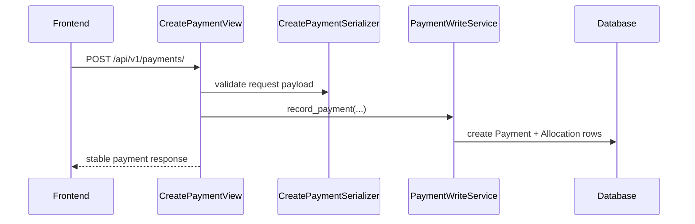
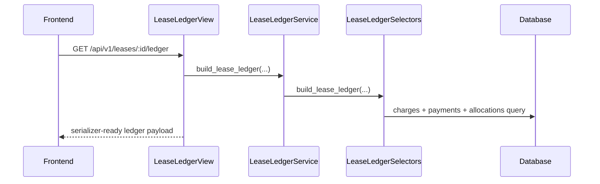
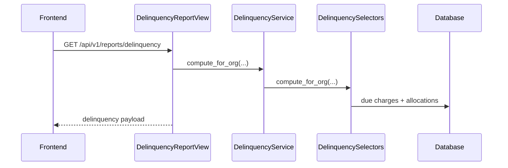

# 02 — Billing Request Lifecycle

## Why this doc exists

The billing app now has a clean separation between write workflows and read-model construction.
This document explains how requests should move through the module.

## Mutation flow principles

Mutation requests should follow this path:

```text
URL -> View -> Serializer -> Service -> Database
```

### Rules

- the view resolves org boundary and returns HTTP responses
- the serializer validates shape and field-level constraints
- the service owns business rules and transaction boundaries
- the database stores immutable financial records

## Read flow principles

Read requests should follow this path:

```text
URL -> View -> Selector/Service facade -> Serializer -> Response
```

### Rules

- selectors own deterministic read queries and aggregation
- thin service facades are allowed when you want a stable service entry point
- views should not reconstruct ledger math

## Example flows

### Record payment



### Build lease ledger



### Build delinquency report


