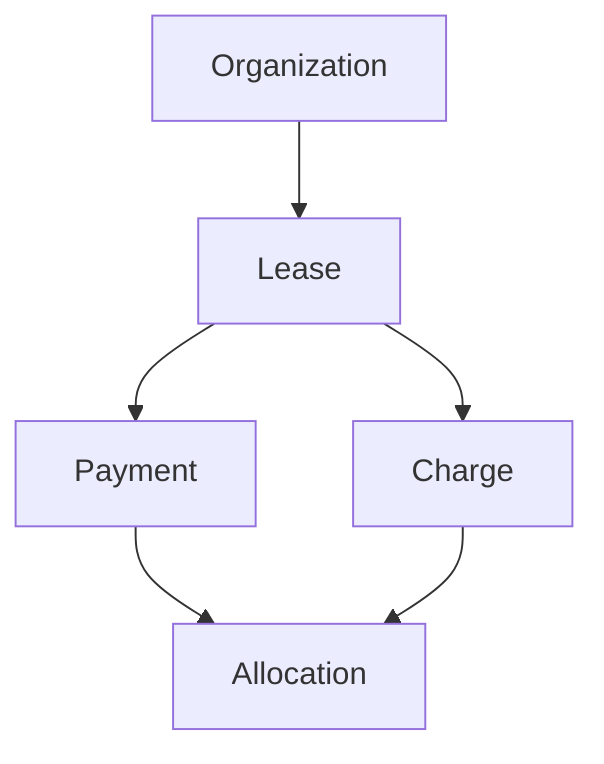

# 03 — Ledger and Allocation Model

## Core formula

The central rule for the billing app is:

```text
Lease balance = sum(charges) - sum(allocations)
```

Not:

```text
Lease balance = some mutable column that gets updated over time
```

## Why allocation exists

Allocation is what makes the ledger trustworthy.

Without Allocation, the system cannot accurately model:

- partial payments
- one payment applied to multiple charges
- multiple payments applied to one charge
- unapplied credit
- delinquency aging from remaining balances

## Relationship diagram



## Allocation guardrails

Allocation writes must enforce:

- payment and charge belong to the same organization
- payment and charge belong to the same lease
- allocation amount is positive
- payment remaining balance is not exceeded
- charge remaining balance is not exceeded

## Write-path concurrency note

Allocation is money logic.
That means allocation writes should happen inside transactions and lock rows where necessary.

Read selectors should never be reused blindly for these write checks when transaction-safe balance math is required.

## Rent generation model

Monthly rent generation is explicit and idempotent.

The service derives:

- eligible month
- due date
- rent amount
- whether a charge already exists for that month

## Lease-month eligibility rule

A lease is eligible for a target month when the lease interval overlaps the month interval.

```text
lease interval = [lease_start, lease_end)
month interval = [month_start, next_month_start)
```

This matches the project’s end-exclusive lease behavior.
