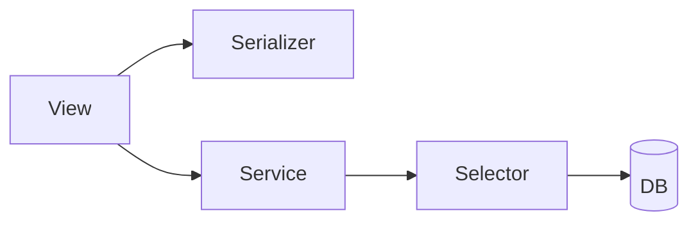

# 04 — Reporting and Selector Architecture

## Why selectors matter here

The billing app now has multiple deterministic read surfaces:

- org dashboard summary
- lease ledger
- delinquency report
- payment balance reads
- charge balance reads

If each service owns its own queries, the app slowly turns into duplicated ledger math and inconsistent naming.

Selectors solve that by giving deterministic reads a clear home.

## Current selector responsibilities

### `billing_queryset.py`
Shared organization-scoped base querysets.

### `org_dashboard_selectors.py`
Computes org-level summary metrics.

### `ledger_selectors.py`
Builds the current lease ledger read model.

### `delinquency_selectors.py`
Builds aging and delinquency rows.

### `payment_selectors.py`
Computes payment allocated and unapplied balances.

### `charge_selectors.py`
Computes charge allocated and remaining balances.

## Service boundary rule

Use this rule of thumb:

### Selector
Use when you are answering a read question.

Examples:
- what is the remaining balance per charge?
- which payments are unapplied?
- what is the lease ledger payload?
- which leases are delinquent?

### Service
Use when you are performing a business workflow.

Examples:
- record payment
- allocate payment
- generate month charge
- run current-month rent posting

## Important reporting contract note

Be explicit with financial terms.

A field like `collected_this_month` can be ambiguous.
Possible meanings include:

- cash received during the month
- cash applied to current-month rent
- cash posted during the month

The billing API should use names that match actual computation behavior.

## Selector/service boundary diagram

## Practical standard

- selectors return deterministic read data
- services may call selectors
- views do not implement financial math
- serializers do not implement financial math
