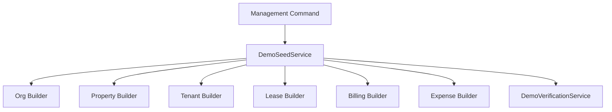

# 02 — Architecture

## High-level model

The `demo_data` app orchestrates real domain apps.



## File structure

```text
backend/
  apps/
    demo_data/
      builders/
        org_builder.py
        property_builder.py
        tenant_builder.py
        lease_builder.py
        billing_builder.py
        expense_builder.py
      scenarios/
        buildings.py
        tenants.py
        leases.py
        billing.py
        expenses.py
      management/
        commands/
          seed_demo_portfolio.py
      constants.py
      seed_service.py
      verification.py
```

## Layer responsibilities

### `scenarios/`
Owns deterministic seed data definitions.

### `builders/`
Owns record creation/reconciliation by concern.

### `seed_service.py`
Owns orchestration order and aggregates results.

### `verification.py`
Owns post-seed assertions that prove the data behaves as intended.

### command
Owns the CLI entrypoint and human-readable output.

## Important boundary rule

`demo_data` should **orchestrate** domain apps, not absorb their domain logic.

That means:
- billing math still lives in billing services/selectors
- lease validity still lives in lease model/domain rules
- expenses still obey expense scope rules
