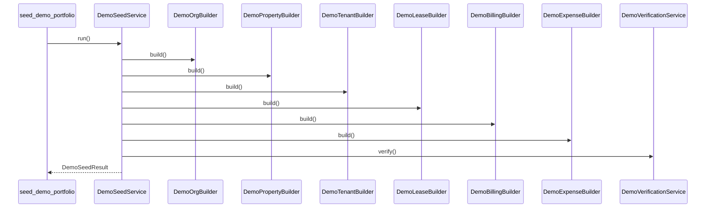

# 03 — Seed Flow

## Current orchestration order

```text
1. Org / user / membership
2. Buildings / units
3. Tenants
4. Leases
5. Billing history
6. Expenses history
7. Verification
```

## Why this order matters

### 1. Organization first
Everything depends on tenant scoping.

### 2. Buildings and units second
Leases and expenses need real property anchors.

### 3. Tenants third
Leases need valid tenant links.

### 4. Leases fourth
Billing history depends on lease existence and lease dates.

### 5. Billing fifth
Charges and payments are generated against real lease intervals.

### 6. Expenses sixth
Expenses depend on org/property/lease scope context.

### 7. Verification last
Verification proves the seeded story actually holds.

## Command flow


