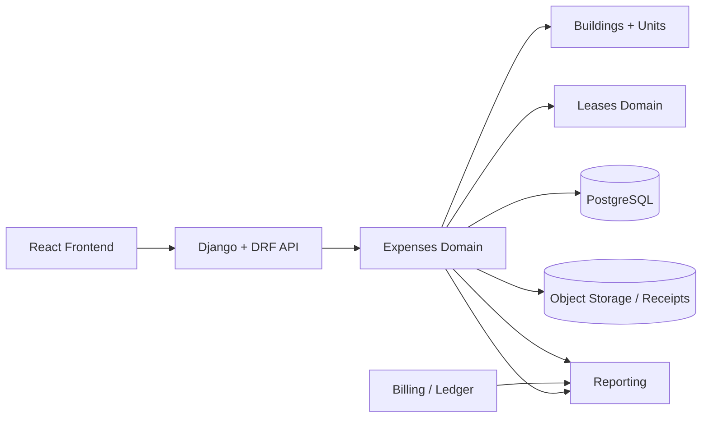
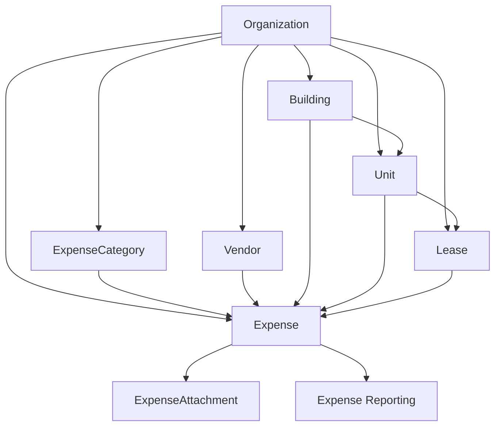
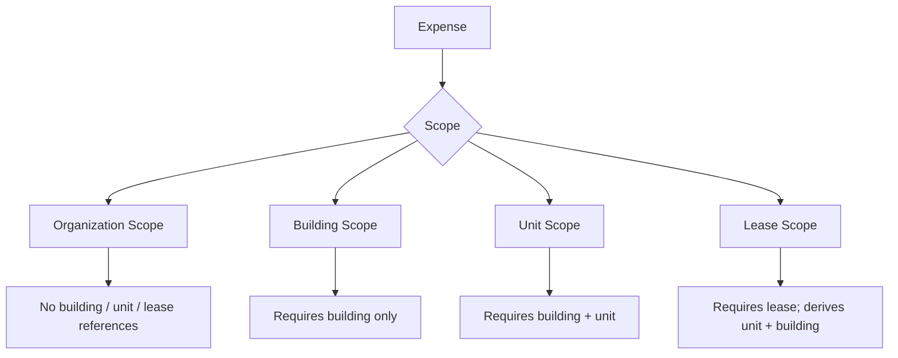
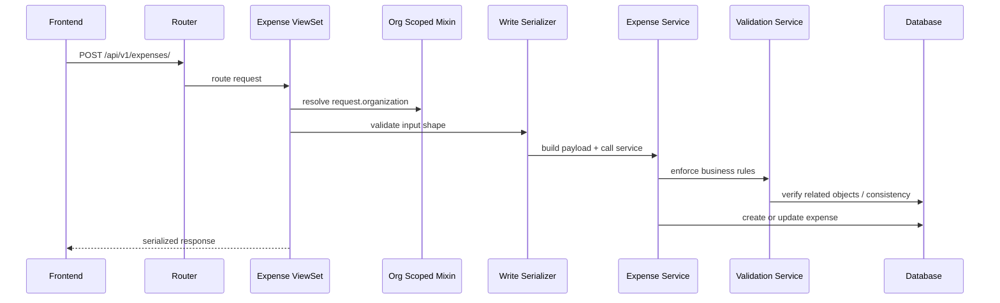
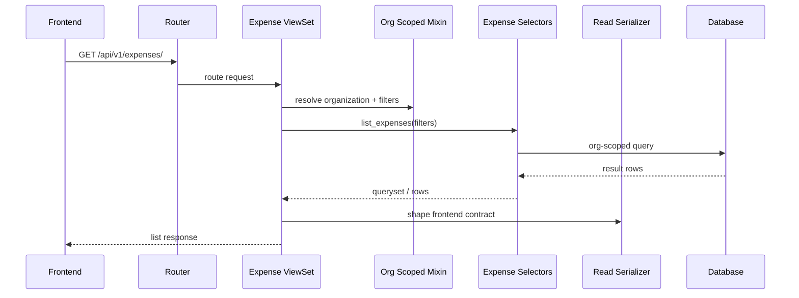
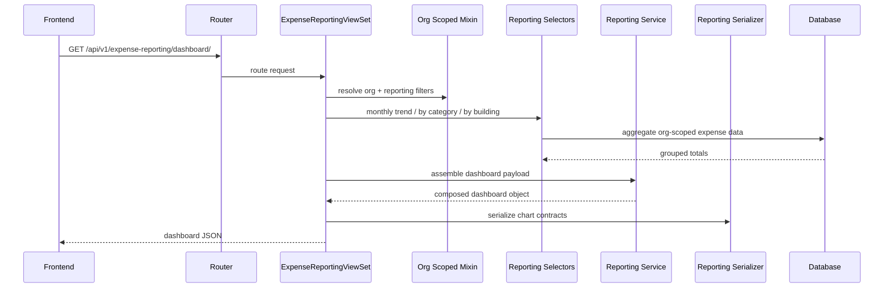

# Expenses Architecture Docs Blueprint

## Why this docs section exists

The `expenses` domain is one of the core financial truth sources in EstateIQ 

- it captures what the landlord spent
- it connects those costs to buildings, units, and leases when appropriate
- it feeds reporting and cash-flow visibility
- it becomes part of the larger portfolio intelligence layer

This document is designed as the architecture reference for the Expenses module.

---

# Recommended docs folder structure

```text
backend/
apps/
  expenses/
    ...code...

docs/
  architecture/
    expenses/
      README.md
      01-domain-overview.md
      02-request-lifecycle.md
      03-scope-and-relationships.md
      04-reporting-and-charting.md
      05-future-evolution.md
      diagrams/
        expenses-context.mmd
        expenses-request-flow.mmd
        expenses-entity-interactions.mmd
        expenses-reporting-flow.mmd
```

## What each file should do

### `docs/architecture/expenses/README.md`
Use this as the entry point.
It should explain:
- what the expenses domain is responsible for
- what it is not responsible for
- where to go next in the docs

### `01-domain-overview.md`
High-level domain explanation:
- why expenses matter
- where they sit in the modular monolith
- how they interact with buildings, units, leases, reporting, and receipts

### `02-request-lifecycle.md`
How a request moves through the backend:
- router
- viewset
- mixin organization resolution
- serializer
- service
- selector
- database

### `03-scope-and-relationships.md`
This is the most important architecture doc.
Explain the four scope types:
- organization
- building
- unit
- lease

Also explain derivation rules, especially:
- lease-scoped expenses derive building and unit from the lease
- reporting can still aggregate by building and unit later because of those persisted relationships

### `04-reporting-and-charting.md`
Dedicated reporting architecture:
- why reporting has its own view surface
- why selectors own aggregation
- why serializers own chart contracts
- current chart endpoints and shapes

### `05-future-evolution.md`
How the domain can grow without breaking shape:
- exports
- tax packets
- mortgage interplay
- anomaly detection
- AI explanation layer
- audit trail and event logging

### `diagrams/`
Keep the diagram source files separate so they can evolve with the code.
Use Mermaid (`.mmd`) or plain markdown diagrams.

---

# Expenses in the overall system

## Context diagram



## Plain-English meaning

The frontend does not talk directly to reporting tables or object storage.
It talks to DRF endpoints.
The expenses domain owns expense records, categories, vendors, and attachments.
That data then becomes one of the core ingredients for reporting.

---

# Domain interaction map

## How expenses relate to the rest of the app



## Meaning of these relationships

### Organization
Every expense record is organization-scoped.
That is the tenant boundary.
Nothing in this module should cross org boundaries.

### Building
A building can accumulate many expenses directly.
Examples:
- roof repair
- hallway electric bill
- exterior maintenance

### Unit
A unit can accumulate more specific expenses.
Examples:
- appliance replacement
- repainting a single apartment
- unit-level cleaning or turnover cost

### Lease
A lease-scoped expense ties the expense to a specific occupancy context.
This is useful when the cost is related to a specific tenancy or resident event.

### Category
Categories make reporting useful.
Without categories, there is no meaningful “what did I spend money on?” experience.

### Vendor
Vendors support both operational tracking and future reporting.
Examples:
- which vendor receives the most spend
- recurring contractor relationships
- expense history by vendor

### Attachment
Attachments keep supporting documents linked to the underlying expense.
These should usually land in object storage and not in the relational database.

---

# Expense scope model

This is one of the most important diagrams in the whole module.



## Why this matters

This is the rule set that keeps the module structurally trustworthy.
Without it, reporting becomes mushy and hard to trust.

## Scope rules in words

### 1. Organization scope
Use when an expense belongs to the portfolio or organization broadly.
Examples:
- accountant fee
- software subscription
- umbrella insurance

### 2. Building scope
Use when the cost belongs to a single building but not a specific unit.
Examples:
- exterior repair
- common area lighting
- boiler service

### 3. Unit scope
Use when the cost belongs to a specific unit.
Examples:
- unit repaint
- appliance replacement
- flooring repair

### 4. Lease scope
Use when the expense belongs to a lease context.
The backend derives the building and unit from the lease so downstream reporting can still group naturally.

---

# Request lifecycle diagram

## Write flow (create / update / archive)



## Read flow (list / detail)



## Reporting flow (charts / dashboard)



---

# How expenses interact with buildings, units, and leases

## Buildings
Buildings are one of the main grouping dimensions for financial truth.
Expenses should support answering:
- how much did this building cost this month?
- which building is underperforming?
- what is the non-rent cost burden per property?

## Units
Units provide more granular operational visibility.
This matters for:
- turnovers
- unit-specific repairs
- spotting problem units
- comparing maintenance intensity between units

## Leases
Leases matter because some costs are resident-contextual rather than just spatial.
Lease linkage allows:
- occupancy-aware cost history
- resident-specific reimbursement logic later
- future tenant/lease cost storytelling

## Important design rule

Even though an expense may be lease-scoped, reporting should still be able to roll it up by:
- building
- unit
- lease
- category
- time period

That is why deriving and persisting building/unit relationships from the lease is a strong design decision.

---

# Reporting architecture

## Why reporting deserves its own view surface

Do not bury chart endpoints inside normal CRUD.
That creates a junk-drawer API over time.

Instead:
- `ExpenseViewSet` owns record lifecycle
- `ExpenseReportingViewSet` owns aggregate and chart responses

## Current reporting targets

### 1. Monthly expense trend
Purpose:
- line chart
- bar chart
- monthly trend cards

### 2. Expense by category
Purpose:
- pie chart
- category leaderboard
- spend distribution

### 3. Expense by building
Purpose:
- compare properties
- surface underperforming buildings
- feed building dashboard cards

## Reporting contract philosophy

Selectors should return deterministic aggregates.
Serializers should shape chart-friendly JSON.
Services should only orchestrate combined payloads when necessary.

---

# Recommended endpoint map

```text
/api/v1/expenses/
/api/v1/expenses/{id}/
/api/v1/expenses/{id}/archive/
/api/v1/expenses/{id}/unarchive/
/api/v1/expenses/{id}/attachments/

/api/v1/expense-categories/
/api/v1/vendors/

/api/v1/expense-reporting/monthly-trend/
/api/v1/expense-reporting/by-category/
/api/v1/expense-reporting/by-building/
/api/v1/expense-reporting/dashboard/
```

---

# Suggested architecture notes to include in the docs

## What the expenses module owns
- expense records
- categories
- vendors
- attachments
- expense-specific reporting selectors
- chart/reporting contracts for expense-driven dashboards

## What the expenses module does not own
- occupancy truth
- lease lifecycle
- rent charges and payments
- full cash-flow rollups across the whole platform
- accountant export pipelines for every domain

That separation matters.
Expenses contributes to portfolio reporting, but it should not become the universal finance god object.

---

# How this module will evolve later

## Near-term
- audit trail for sensitive expense mutations
- reporting tests
- building detail report cards
- CSV export support

## Mid-term
- mortgage and expense interaction in property profitability views
- vendor analytics
- reimbursement workflows
- attachment preview / OCR support if useful

## Long-term
- anomaly detection on spend spikes
- AI explanation layer grounded in reporting outputs
- automated executive summaries
- tax packet generation

---

# Recommended diagram style rules

Use the same style throughout the repo:

1. One main idea per diagram.
2. Prefer Mermaid for versionable diagrams.
3. Pair each diagram with a plain-English explanation.
4. Do not make diagrams purely decorative.
5. Keep domain ownership explicit.
6. Show org scoping whenever the data crosses domain boundaries.

---

# Suggested README blurb for the docs section

```md
## Expenses Architecture Docs

The `expenses` domain has dedicated architecture docs because it sits at the intersection of operations, financial reporting, and future portfolio intelligence.

See:
- `docs/architecture/expenses/01-domain-overview.md`
- `docs/architecture/expenses/02-request-lifecycle.md`
- `docs/architecture/expenses/03-scope-and-relationships.md`
- `docs/architecture/expenses/04-reporting-and-charting.md`
- `docs/architecture/expenses/05-future-evolution.md`
```

---

# Final recommendation

Yes — add the architecture folder structure and rich diagrams.
That is not overkill.
For this project, it is leverage.

It will help with:
- keeping your own mental model clean
- onboarding contributors later
- making the repo look senior and intentional
- preventing the reporting surface from drifting into chaos
- giving future AI agents and RAG tooling a clean architectural knowledge base
