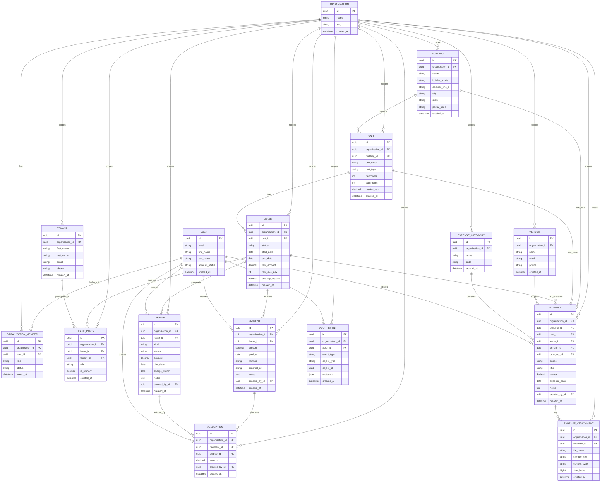

# PortfolioOS / EstateIQ — Enterprise Entity Diagram

This ERD models the current enterprise domain in a way that is consistent with the architecture decisions already made for PortfolioOS / EstateIQ.

## Entity design principles

- Every business record is organization-scoped directly or through an org-owned parent.
- Units do **not** own occupancy truth; leases do.
- Billing records belong primarily to the **lease**.
- Money is represented as **charges, payments, and allocations**.
- Expenses remain a separate domain and feed reporting without becoming the billing system.
- Reporting is derived from source-of-truth domains rather than hand-maintained summary fields.

---

## Enterprise ERD



---

## Domain invariants that matter

### 1. Occupancy is lease-derived

A unit is occupied because it has an active lease.

Do **not** store a separate `Unit.is_occupied` truth flag as the primary source of truth.

### 2. Billing is lease-scoped

The ownership path is:

```text
Organization -> Building -> Unit -> Lease -> Charge / Payment / Allocation
```

That means billing context is derived through the lease rather than using building or unit as the primary money owner.

### 3. Lease balance is derived

```text
lease_balance = SUM(charge.amount) - SUM(allocation.amount)
```

Do **not** store mutable balance fields as source-of-truth accounting state.

### 4. Expenses are a separate truth domain

Expenses may be building-scoped, unit-scoped, or lease-contextual, but they are not the billing system.

### 5. Audit events are first-class

Sensitive mutations should emit audit events with at least:

- organization
- actor
- event type
- object type
- object id
- timestamp
- domain-specific metadata that is safe to store

---

## Suggested GitHub note below the ERD

You can paste this under the diagram in the repo:

> PortfolioOS uses a lease-driven, ledger-first data model. Occupancy comes from active leases, not mutable unit flags. Money is modeled as charges, payments, and allocations so balances, delinquency, and future AI explanations stay deterministic and auditable.
