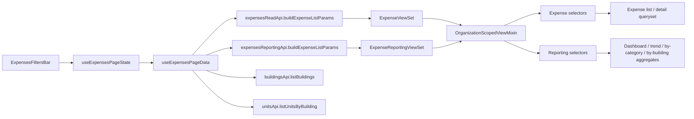
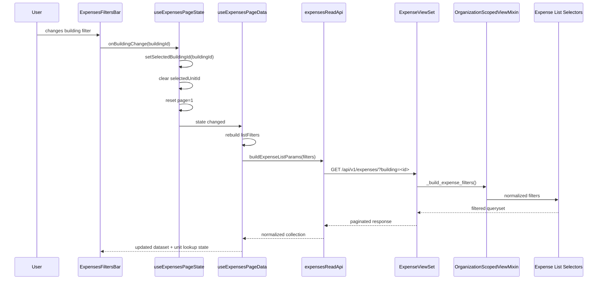
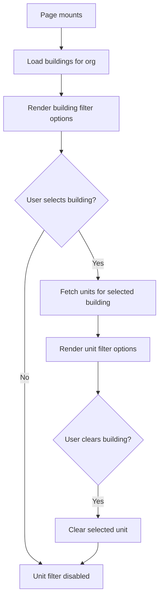
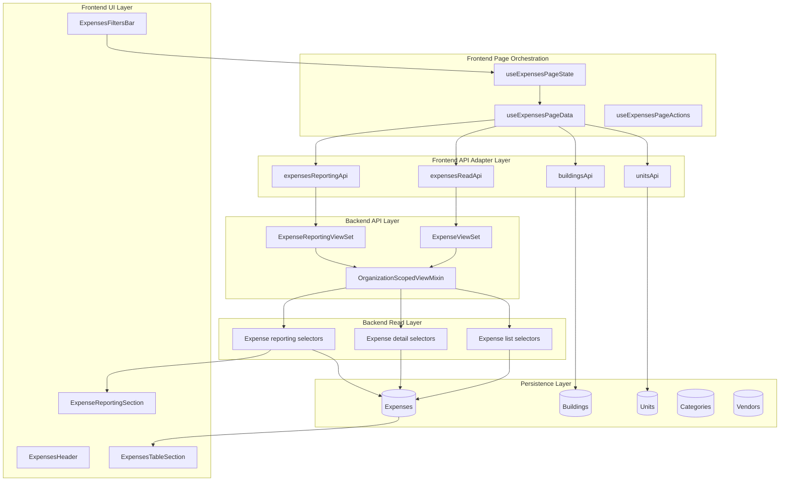

# Expenses Filter System Architecture

## EstateIQ / PortfolioOS

### Version
Current scoped-expense design after organization, building, and unit filtering rollout.

---

## 1. Purpose

The Expenses Filter System exists to do one job well:

**give the user a fast, deterministic, organization-safe way to narrow the expenses dataset for both records and reporting.**

This is not a cosmetic filter row.
This is a core query orchestration layer that sits between:

- page-local UI state
- frontend API adapters
- org-scoped backend query param parsing
- selector-driven expense queries
- reporting aggregation endpoints

The system is designed so that the same filter language can drive:

- the Records workspace
- the Reporting workspace
- future exports / CSV / PDF views
- future AI explanations grounded in deterministic expense slices

---

## 2. Design Principles

### 2.1 Single filter language across records and reporting
The filter system should not invent one contract for records and another for reporting.

The canonical filter language is:

- `search`
- `scope`
- `building`
- `unit`
- `lease`
- `category`
- `vendor`
- `status`
- `reimbursement_status`
- `is_reimbursable`
- `is_archived`
- `expense_date_from`
- `expense_date_to`
- `due_date_from`
- `due_date_to`
- `ordering`
- `page`
- `page_size`
- `top_n` (reporting only)

### 2.2 UI state stays frontend-friendly
The frontend is allowed to use UI-friendly names like:

- `category_id`
- `vendor_id`
- `building_id`
- `unit_id`
- `lease_id`

But the API layer must translate those into backend field/query names.

### 2.3 Organization safety is non-negotiable
All lookups and all expense queries are organization-scoped.

The filter system never assumes cross-tenant visibility.

### 2.4 Chained property filtering
Unit filtering is intentionally dependent on building selection.

That means:

- buildings load first
- units load after building selection
- clearing building clears unit

### 2.5 Deterministic rollup behavior
The filter system narrows the dataset.
It does not reinterpret expense ownership.

Examples:

- organization view = all expenses in org
- building filter = all expenses attributable to that building
- unit filter = only expenses attributable to that unit

---

## 3. High-Level Architecture



---

## 4. Layer Responsibilities

## 4.1 `ExpensesFiltersBar.tsx`
This is the presentational filter shell.

Responsibilities:

- render search input
- render scope/category/vendor/building/unit dropdowns
- render archived toggle
- show active filter pills
- provide a clear-filters action
- never own data fetching

This component should remain UI-only.
It must not fetch buildings, units, or expenses itself.

### Inputs it expects
- current filter values
- category/vendor/building/unit options
- loading/error flags for property lookups
- change handlers from page orchestration

---

## 4.2 `useExpensesPageState.ts`
This is the page-local state owner.

Responsibilities:

- hold current filter state
- hold edit/create mode state
- hold row processing state
- hold records pagination state
- expose reset/transition helpers

### Canonical page-local filter state
- `searchInput`
- `selectedScope`
- `selectedCategoryId`
- `selectedVendorId`
- `selectedBuildingId`
- `selectedUnitId`
- `showArchivedOnly`

### Important orchestration behavior
- changing any filter resets records pagination to page 1
- changing building clears unit
- switching to organization scope clears building and unit
- switching to building scope clears unit

---

## 4.3 `useExpensesPageData.ts`
This is the read-model orchestration layer.

Responsibilities:

- translate page state into record filters
- translate page state into reporting filters
- fetch expense list
- fetch category/vendor lookups
- fetch building/unit filter lookups
- fetch reporting data
- map expense detail into edit form initial values
- consolidate loading/error state for the page

### Why this hook matters
This is the boundary where raw UI state becomes a deterministic dataset contract.

It is the most important filter orchestration layer on the frontend.

---

## 4.4 `expensesReadApi.ts`
This file owns the translation from frontend filter names to backend query params.

### Frontend naming
- `category_id`
- `vendor_id`
- `building_id`
- `unit_id`
- `lease_id`

### Backend naming
- `category`
- `vendor`
- `building`
- `unit`
- `lease`

### Why this translation lives here
The page and components should not care about backend serializer/query parameter names.
That mapping belongs in the API adapter layer.

---

## 4.5 `OrganizationScopedViewMixin`
This is the backend normalization boundary.

Responsibilities:

- resolve request organization
- parse boolean query params safely
- parse integer reporting options safely
- normalize expense filters from request query params
- normalize reporting filters from request query params

### Canonical backend filter builder
The mixin normalizes:

- `building`
- `unit`
- `lease`
- `category`
- `vendor`
- `status`
- `scope`
- `reimbursement_status`
- `is_reimbursable`
- `is_archived`
- `expense_date_from`
- `expense_date_to`
- `due_date_from`
- `due_date_to`
- `search`

### Reporting-specific rule
Reporting excludes archived expenses by default unless explicitly overridden.

That is a deliberate product choice:
reporting should default to active operating data, not historical clutter.

---

## 5. Canonical Data Flow



---

## 6. Records Filter Contract

The Records workspace is the operational expense list.

### Current intended records filters
- search
- scope
- category
- vendor
- building
- unit
- archived-only
- pagination

### Records filter object at the page layer

```ts
{
  search?: string;
  scope?: "organization" | "building" | "unit" | "lease";
  category_id?: number | null;
  vendor_id?: number | null;
  building_id?: number | null;
  unit_id?: number | null;
  is_archived?: boolean;
  page?: number;
  page_size?: number;
}
```

### Records backend query params after translation

```ts
{
  search?: string;
  scope?: string;
  category?: number;
  vendor?: number;
  building?: number;
  unit?: number;
  is_archived?: boolean;
  page?: number;
  page_size?: number;
}
```

---

## 7. Reporting Filter Contract

The Reporting workspace should use the same scoped dataset language as Records.

### Current intended reporting filters
- scope
- building
- unit
- category
- vendor
- later date ranges and top_n

### Why this matters
If reporting and records use different filter contracts, users lose trust.
They should be able to say:

> show me this building in records

and then switch to reporting and still be looking at the same building slice.

---

## 8. Property Lookup Architecture

### Buildings lookup
Buildings should load once for the active org.

Source:
- `buildingsApi.listBuildings({ orgSlug, ... })`

### Units lookup
Units should load only when a building is selected.

Source:
- `unitsApi.listUnitsByBuilding({ orgSlug, buildingId, ... })`

### Why this is chained
This keeps the unit dropdown:
- relevant
- small
- deterministic
- easy to understand

It also prevents the UI from loading every unit in the org unnecessarily.

---

## 9. Property Lookup Flow



---

## 10. Current Behavioral Rules

## 10.1 Organization-level behavior
With no building or unit filter applied, the records workspace should show all expenses visible to the active organization.

## 10.2 Building-level behavior
When a building is selected, the dataset should include expenses attributable to that building.

That means:
- direct building-scoped expenses
- unit expenses belonging to units in that building
- later, lease-derived expenses tied to that building

## 10.3 Unit-level behavior
When a unit is selected, the dataset should narrow to expenses attributable to that unit.

## 10.4 Building clears unit
Because units are building-dependent, changing or clearing a building must clear the selected unit.

This is both a correctness rule and a UX rule.

---

## 11. Filter Ownership Matrix

| Concern | Owner | Why |
|---|---|---|
| Filter input UI | `ExpensesFiltersBar` | Presentational only |
| Selected filter values | `useExpensesPageState` | Page-local orchestration state |
| Filter-to-query translation | `useExpensesPageData` + `expensesReadApi` | Centralized contract mapping |
| Property lookup fetching | `useExpensesPageData` | Page-level dependency for filters |
| Org scoping | backend middleware + `OrganizationScopedViewMixin` | Tenant safety |
| Query parsing | `OrganizationScopedViewMixin` | Uniform request normalization |
| Data filtering | selectors/querysets | Deterministic backend reads |

---

## 12. Error Handling Strategy

### Frontend
The filter system should surface lookup failures without collapsing the page.

Examples:
- buildings fail to load -> show property lookup warning
- units fail to load -> keep unit dropdown disabled and show warning
- expenses list fails -> show records workspace error state

### Backend
Invalid query param values should fail as validation errors, not server crashes.

Examples:
- invalid boolean query value
- invalid integer query value
- unsupported scope value

---

## 13. Performance Notes

### Good current decisions
- records pagination is explicit
- unit lookup is chained behind building
- reporting is separate from records CRUD
- filter normalization is centralized

### Recommended future hardening
- memoize large option lists where needed
- reuse property lookup queries across records and reporting if both are visible together
- consider debouncing search input
- consider URL-sync for filters later if deep-linking becomes important

---

## 14. Extension Roadmap

## 14.1 Near-term improvements
- add date range filters to Records UI
- add scope/building/unit filters visibly to Reporting UI
- show more polished empty/loading states
- add unit-aware reporting behavior when a building is selected

## 14.2 Mid-term improvements
- add lease filter support in UI
- add saved filter presets
- add CSV export using the same filter contract
- add URL-synced filters for deep links

## 14.3 AI-ready future
Because the filter system already produces deterministic scoped datasets, it can later support AI prompts such as:

- "Explain spending for Building A this quarter"
- "Show why Unit 2 had higher expenses"
- "Summarize vendor concentration for this building"

That only works because the filter system is grounded in real queryable slices.

---

## 15. Enterprise Diagram — Full Filter System Ownership



---

## 16. Recommended Documentation Placement

Suggested docs path:

```text
/docs/architecture/expenses/expenses_filter_system_architecture.md
```

This file pairs well with:

- expenses reporting architecture docs
- expenses scoped-expense model docs
- expense API contract docs
- page orchestration docs

---

## 17. Final Summary

The Expenses Filter System is not just a UI convenience.
It is a multi-layer architecture that ensures:

- organization safety
- deterministic scoped reads
- reusable records/reporting filter language
- clean frontend/backend contract boundaries
- scalable property-aware expense workflows

In plain English:

**the filter system is the control plane for the expenses workspace.**

It tells the application exactly which expense slice the user wants to see, and it does so in a way that stays trustworthy, composable, and ready for future reporting and AI features.
