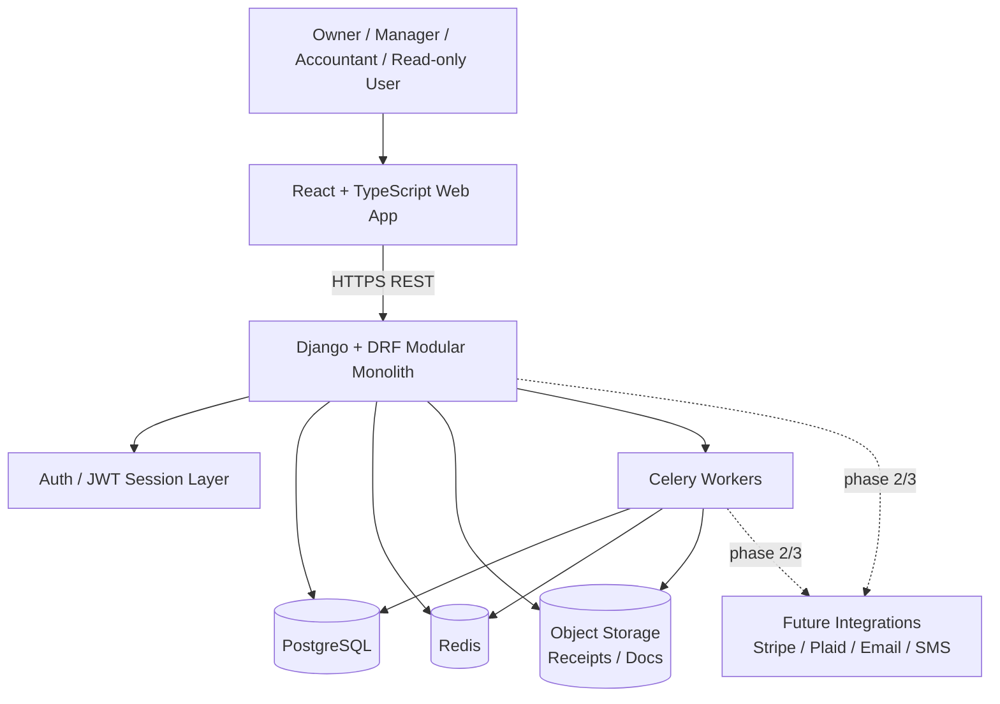
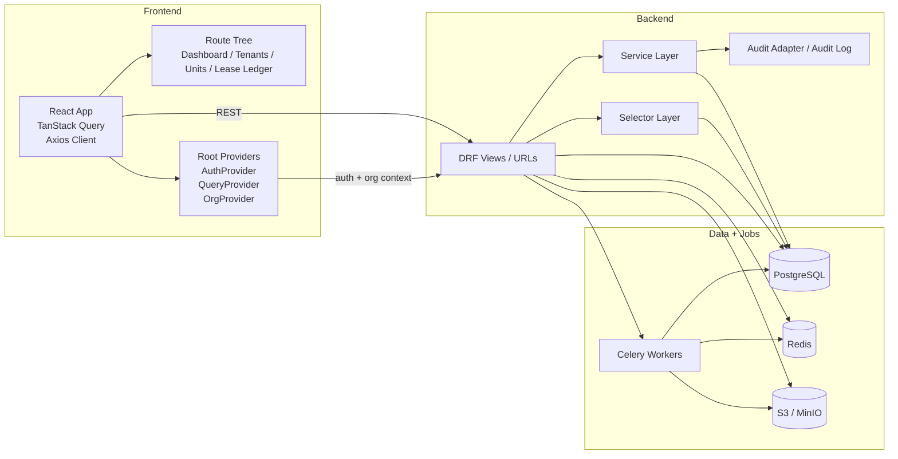
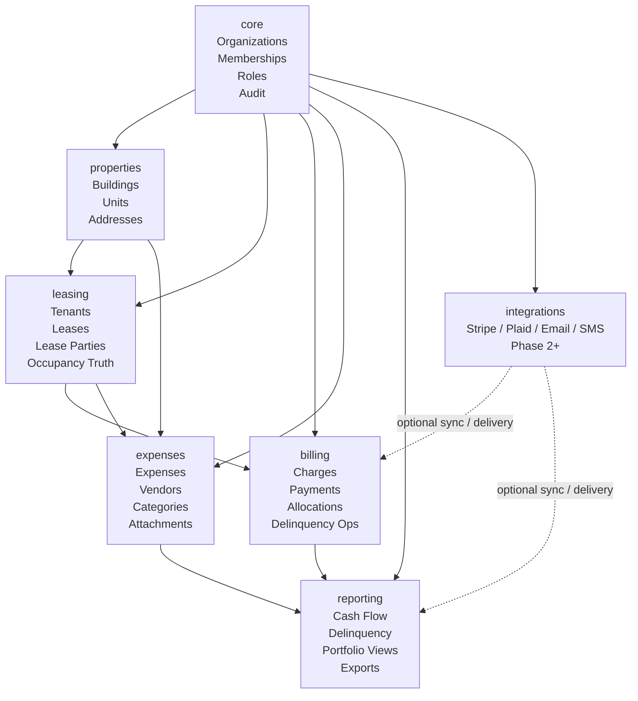
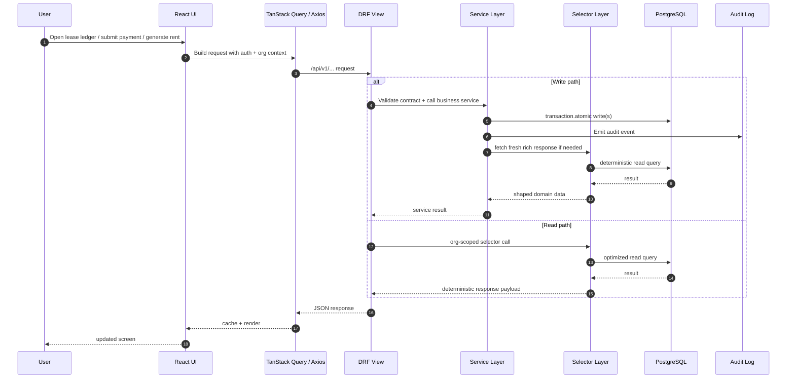
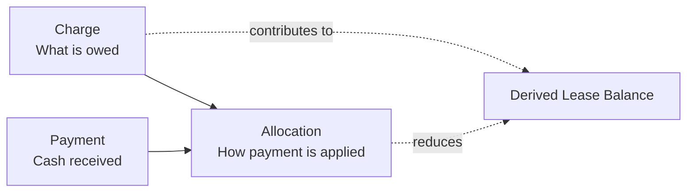
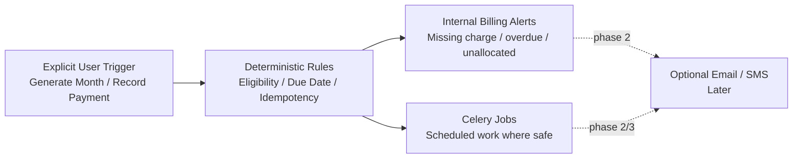

# PortfolioOS / EstateIQ — System Architecture

PortfolioOS / EstateIQ is a multi-tenant financial operating system for small real estate portfolios.
It is intentionally built as a **modular monolith** first so the product can move quickly without giving up clean domain boundaries.

## Architecture principles

- **Organization-scoped from day one**
- **Lease-driven occupancy**
- **Ledger-first financial truth**
- **Thin API layer, rich service layer**
- **Selectors for deterministic reads**
- **Auditability over magic**
- **Explicit automation, not silent assumptions**

---

## 1. System context



### Why this shape is right

- The **frontend** stays focused on workflow, state, and UX.
- The **Django monolith** keeps transactions, org scoping, and domain logic close together.
- **PostgreSQL** is the source of truth.
- **Redis + Celery** handle scheduled and async work without forcing a microservice split too early.
- **Object storage** keeps receipts and documents out of the database.

---

## 2. Container / runtime view



---

## 3. Backend domain map



### Domain ownership rules

- `core` owns org identity, membership, and access control.
- `properties` owns real estate structure.
- `leasing` owns occupancy truth and lease lifecycle.
- `billing` owns receivables truth: charges, payments, allocations.
- `expenses` owns spend truth and receipts.
- `reporting` owns aggregate read surfaces, not source-of-truth records.

---

## 4. Request lifecycle



### Why this matters

This keeps:

- **views thin**
- **business rules in services**
- **read/report logic in selectors**
- **database writes transaction-safe**
- **audit events attached to sensitive actions**

---

## 5. Financial truth model



**Balance is derived, never stored as mutable truth.**

```text
lease_balance = SUM(charges.amount) - SUM(allocations.amount)
```

That supports:

- partial payments
- aging buckets
- delinquency reporting
- auditability
- future AI explanations grounded in real math

---

## 6. Job and automation posture



The system favors **deterministic but explicit** operations before full automation.
