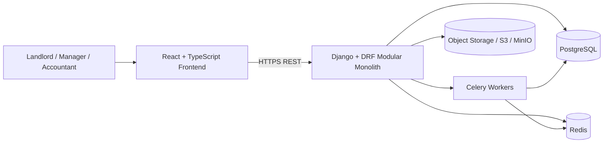

# 01. System Context

This diagram shows the top-level runtime shape of EstateIQ.

## Plain-English meaning

- The frontend talks to the backend over HTTPS.
- The backend owns business logic and data access.
- PostgreSQL stores the core system of record.
- Redis and Celery support background jobs and asynchronous tasks.
- Object storage holds receipts and lease documents.
