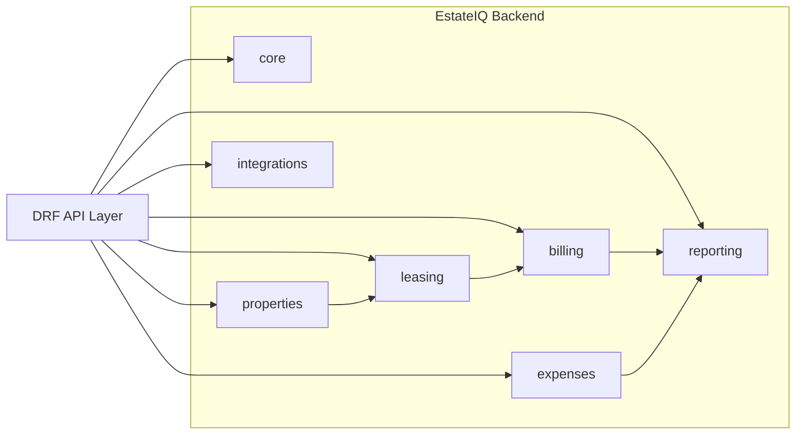

# 02. Backend Domain Boundaries

The backend is a **modular monolith**.
That means the system deploys as one application, but business logic is separated by domain.

## Ownership notes

- `core` owns organizations, memberships, and shared platform concerns.
- `properties` owns buildings and units.
- `leasing` owns tenants, leases, and occupancy truth.
- `billing` owns charges, payments, allocations, and delinquency logic.
- `expenses` owns expense records, categories, vendors, and attachments.
- `reporting` owns aggregate read models and dashboard payloads.
- `integrations` is where future external systems live without contaminating core domains.
