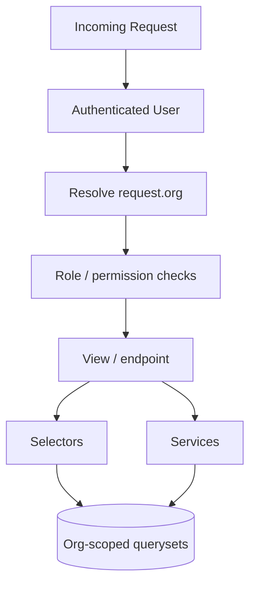

# 03. Organization Scoping Boundary

Cross-tenant leakage is the highest-priority architectural failure to avoid.

## Rules

- Every request must resolve an organization context.
- Every queryset must be filtered by organization.
- Role checks must happen before sensitive actions.
- Tests must assert that one org cannot see another org’s data.
