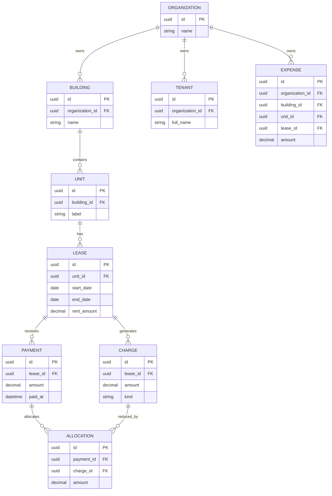

# 04. Core Entity Relationship Diagram

This is the core data spine of the product.

## Why this matters

This structure separates:
- property structure
- lease lifecycle
- receivables ledger
- operating expenses

That separation is what makes reporting trustworthy later.
