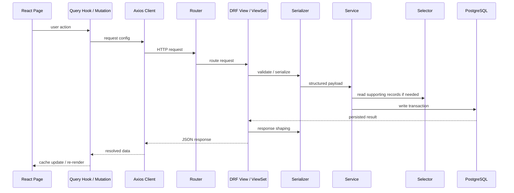

# 05. Fullstack Request Lifecycle

This is the typical path from UI action to database write.

## Architectural meaning

- Frontend pages should orchestrate, not own business rules.
- The Axios client centralizes auth and transport behavior.
- Views stay thin.
- Serializers define contracts.
- Services own mutation rules.
- Selectors own read/query logic.
