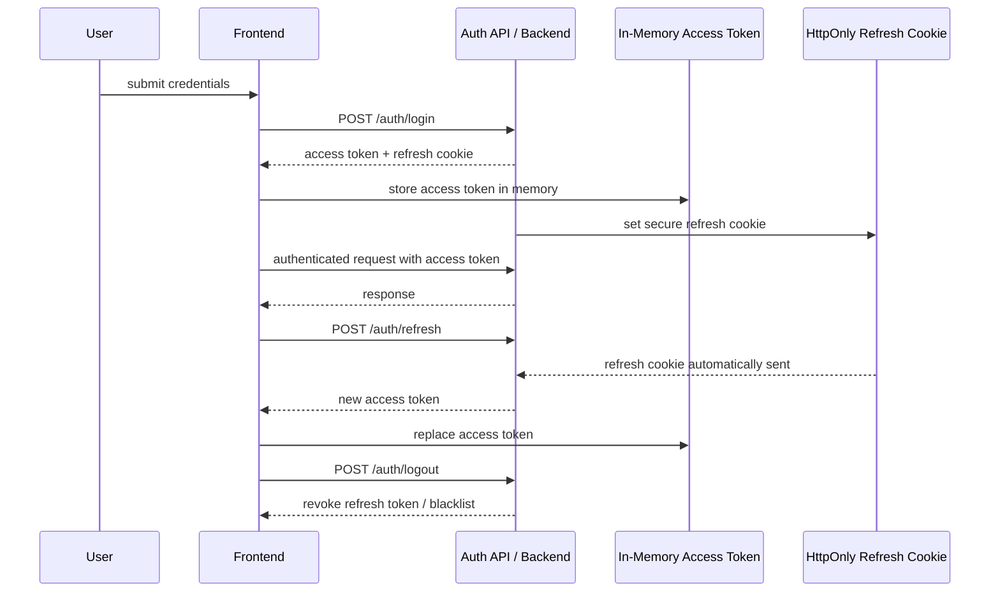

# 06. Auth and Session Flow

EstateIQ can support either standard Simple JWT or a central Auth API pattern.
This diagram shows a safe browser-session model.

## Security posture

- Avoid storing refresh tokens in `localStorage`.
- Prefer secure, HttpOnly cookies for refresh.
- Keep access tokens short-lived.
- Apply rate limiting to login and refresh endpoints.
