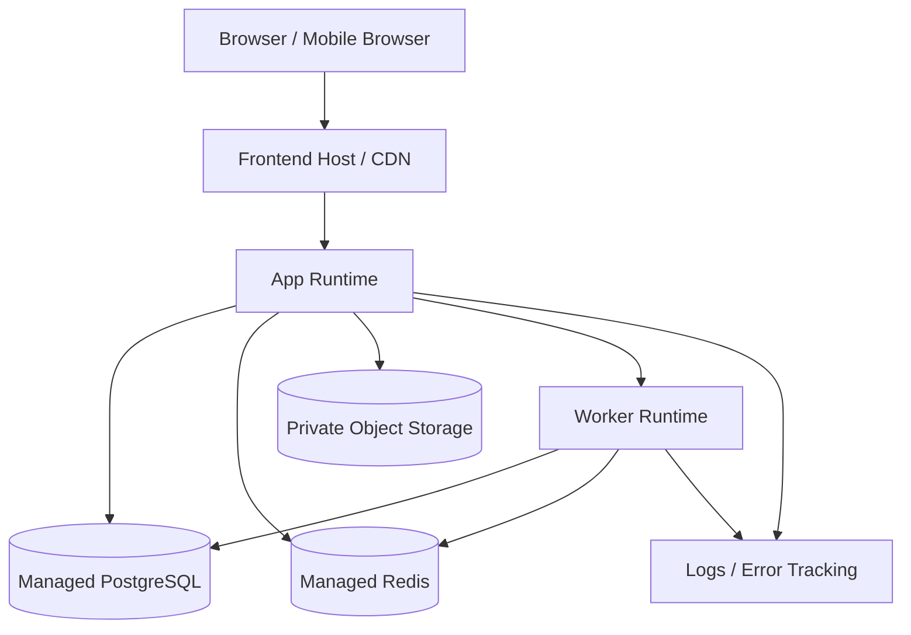

# 07. Deployment Topology

This is a production-oriented runtime view.

## Environment model

- `dev`
- `staging`
- `prod`

Each environment should have its own database, Redis, storage bucket, and secrets.
