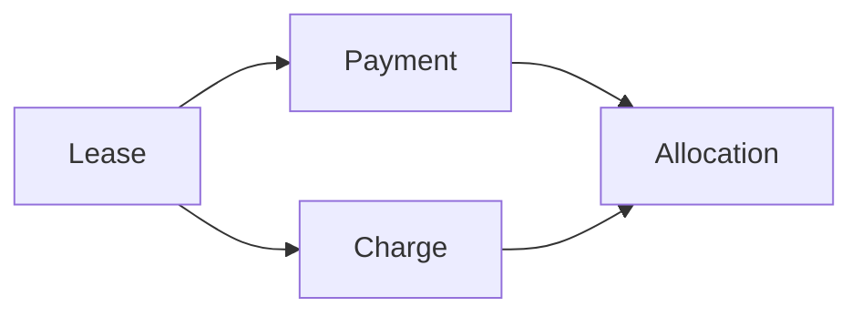

# Billing Domain Overview

The billing domain is not “rent reminders.”
It is the financial infrastructure that tracks what a lease owes and what has been received.

## Product stance

The system should be **deterministic but explicit**:

- money owed is represented by charges
- money received is represented by payments
- money applied is represented by allocations
- balances are derived, not manually edited

## Why this domain matters

This is the layer that makes the rest of the product trustworthy.

Without a clean billing model, the system cannot reliably answer:

- who owes what?
- what is overdue?
- what payment still has unapplied value?
- what did this lease end owing?
- what happened financially across the life of the lease?

## Scope boundary

Billing is **lease-scoped**, not unit-scoped.

That means:

- the lease owns the obligation context
- the unit provides property context and history context
- old tenant obligations should never be blended into a new tenant’s ledger

## Frontend implication

The lease ledger page is the lease billing workspace.

It should let the user:

- review charges
- review payments
- review allocations
- review derived balance and unapplied amounts
- record a payment
- explicitly generate a rent charge

That page is not a general-purpose finance dashboard and not a combined history of every lease in the unit.
