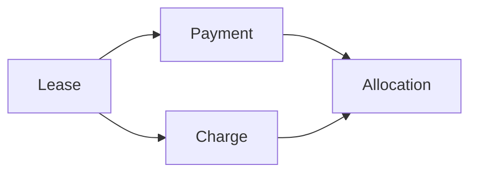

# Billing Domain Overview

The billing domain is not “rent reminders.”
It is the financial infrastructure that tracks what a lease owes and what has been received.

## Product stance

The system should be **deterministic but explicit**:
- money owed is represented by charges
- money received is represented by payments
- money applied is represented by allocations
- balances are derived, not manually edited
