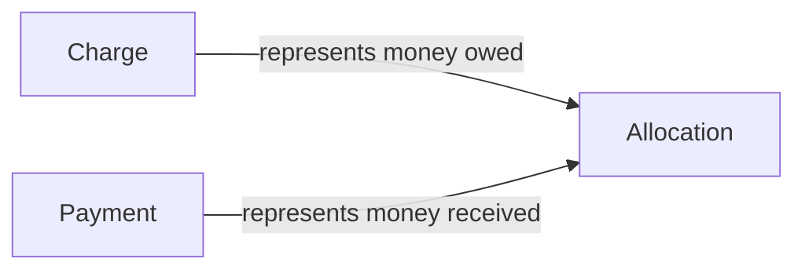

# Billing Ledger Model



## Core formula

```text
lease_balance = SUM(charge.amount) - SUM(allocation.amount)
payment_unallocated = payment.amount - SUM(allocation.amount)
charge_remaining = charge.amount - SUM(allocation.amount)
```

## Why this shape wins

- preserves immutable money history
- supports partial payments
- supports backdated payments
- supports aging and delinquency
- stays explainable for both humans and AI
