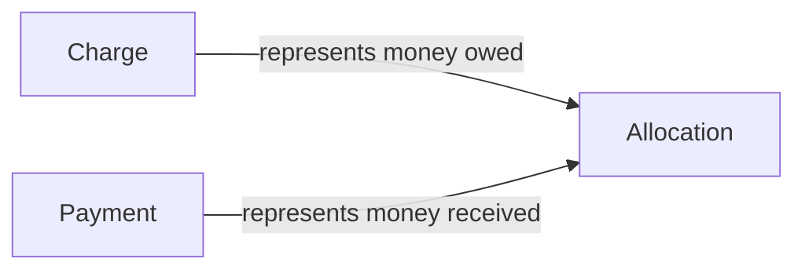

# Billing Ledger Model



## Core formula

```text
lease_balance = SUM(charge.amount) - SUM(allocation.amount)
payment_unallocated = payment.amount - SUM(allocation.amount)
charge_remaining = charge.amount - SUM(allocation.amount)
```

## Why this shape wins

- preserves immutable money history
- supports partial payments
- supports backdated payments
- supports aging and delinquency
- stays explainable for both humans and AI

## Interpret the records correctly

### Charge
A charge is an obligation.

Typical MVP example:
- monthly rent

Future examples:
- late fee
- misc adjustment

### Payment
A payment is money received and recorded.

It does not automatically mean the whole amount has been applied yet.

### Allocation
An allocation is the link between a payment and a charge.

This is what makes the ledger auditable and explainable.

## Why balance is derived

If balance were stored as mutable state, the system would be easier to corrupt and harder to trust.

By deriving balance from charges and allocations, the product stays:

- testable
- auditable
- deterministic
- ready for future reporting and AI explanation

## Frontend implication

The frontend should not try to recreate ledger truth from scratch.

It should render backend-derived read models such as:

- totals
- charge remaining balance
- payment unapplied amount
- delinquency buckets
