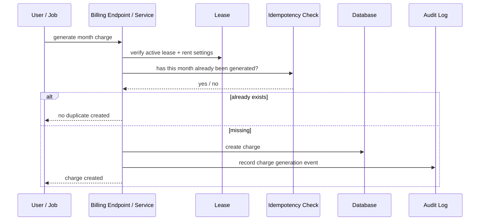

# Rent Charge Generation Flow

Monthly rent posting should be explicit and idempotent.

## Design rule

Do not assume automatic posting for every org by default.
A later auto-generation policy can sit on top of this deterministic service.

## Why explicit generation matters

The system should avoid silently inventing financial facts.

Explicit posting keeps the workflow understandable and gives the user operational control.

## Frontend implication

The lease ledger page should expose a clear action such as:

- `Generate rent charge`

That action should:

- target one lease
- target one month
- rely on the backend for eligibility and idempotency
- refresh the lease ledger after success

## What this flow is not

It is not:
- a hidden cron-only feature
- a blind “always create rent” job
- a browser-side due date calculator
