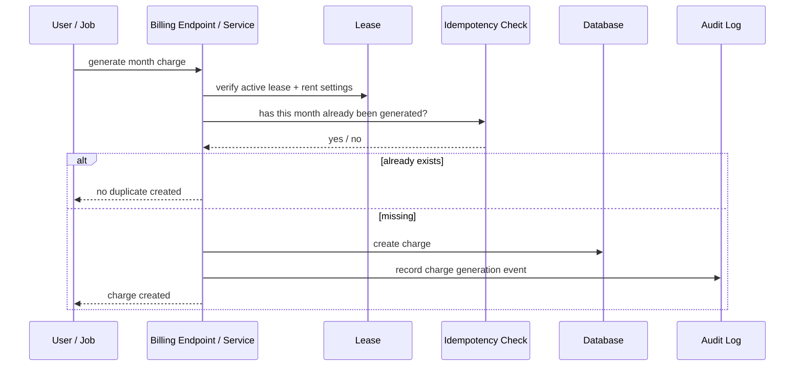

# Rent Charge Generation Flow

Monthly rent posting should be explicit and idempotent.

## Design rule

Do not assume automatic posting for every org by default.
A later auto-generation policy can sit on top of this deterministic service.
