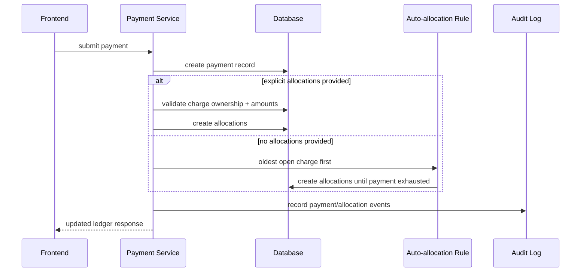

# Payment Recording and Allocation Flow

## Rules

- Allocations stay within the same lease.
- A payment cannot over-allocate.
- Auto-allocation should stop when the payment is exhausted.

## Why allocation matters

Without allocations, the product cannot reliably answer:

- what part of this payment is still unapplied?
- which charge is still open?
- how much of this delinquency has already been reduced?
- what happened when a payment was partially applied?

## Frontend implication

The payment entry flow should let the user:

- record a payment
- choose an allocation mode
- see the ledger refresh after success

The browser should not decide allocation validity.
That remains backend-owned.

## MVP stance

Start with:
- auto allocation
- unapplied cash support
- future manual allocation path

That gets the system usable without sacrificing correctness.
