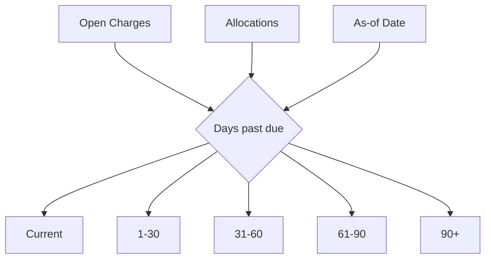

# Delinquency and Alerts

Delinquency is a derived operational signal, not a manually maintained status field.

## Internal alert candidates

- missing expected monthly charge
- due soon
- overdue
- partially paid overdue
- unallocated cash
- lease with persistent delinquency
