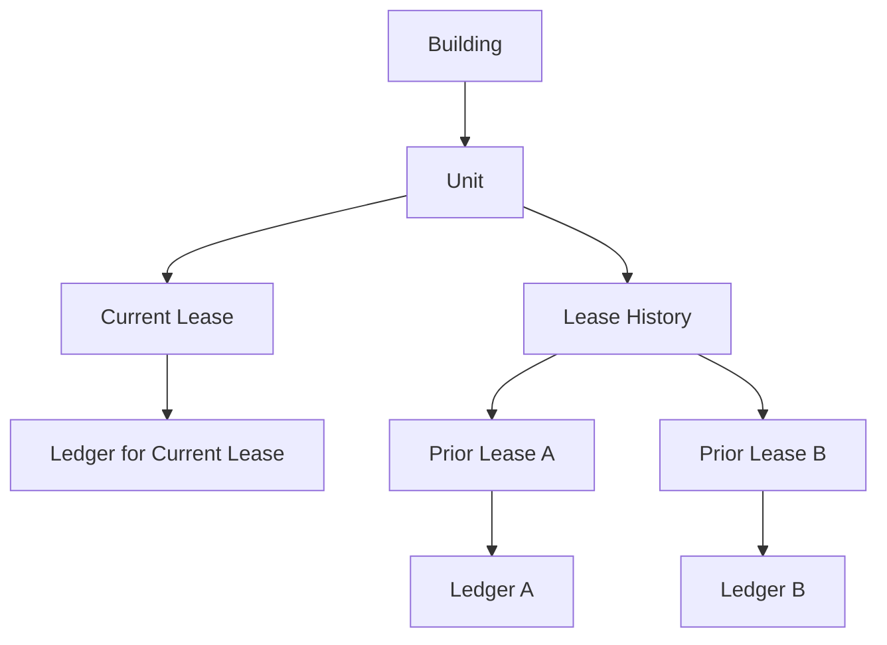

# Lease History and Unit Timeline

The unit and the lease do not own the same kind of history.

## Core rule

> The unit owns the timeline.  
> The lease owns the ledger.

## What the unit owns

The unit page should tell the rolling occupancy story:

- who lived here over time?
- which lease is current?
- what leases ended?
- how did rent change across leases?

## What the lease owns

Each lease owns its own immutable billing history:

- charges
- payments
- allocations
- derived balance
- delinquency state as-of dates

## What happens when a lease ends

When Lease A ends:

- it leaves the Current Lease section
- it moves into Lease History
- its ledger remains intact
- it can still receive a late payment if that payment belongs to Lease A

When Lease B starts:

- it becomes the Current Lease
- it gets a new billing lifecycle
- it gets a separate ledger

## UI implication

On the Unit Detail page:

### Current Lease
Show:
- tenant
- dates
- rent
- due day
- status
- actions:
  - Edit Lease
  - View Ledger

### Lease History
Show:
- tenant
- lease dates
- status
- rent amount
- actions:
  - Open Lease
  - View Ledger

## What not to do

Do not create one combined unit ledger across multiple tenants.
That would blur obligation boundaries and make the billing model untrustworthy.
