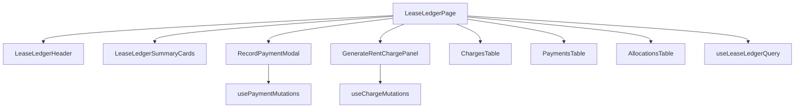

# Frontend Lease Ledger Workspace

The lease ledger page is the billing workspace for a single lease.

Current route:

```text
/dashboard/leases/:leaseId/ledger
```

## Purpose

This page should let the user:

- review charges
- review payments
- review allocations
- review backend-derived balance totals
- record a payment
- explicitly generate a rent charge
- move back to the unit context cleanly

## Current frontend direction



## Page responsibilities

The page should be orchestration-focused.

It should:

- read the lease id from the route
- resolve org context
- call the lease ledger query hook
- coordinate layout and modal state
- compose child components

It should not:

- own transport logic
- own ledger math
- own allocation rules
- own delinquency calculations

## UX direction

The page should feel like part of the existing application.

Desired UX features:

- Back to Unit
- clear lease header
- summary cards
- billing actions
- charges, payments, and allocations presented as first-class read surfaces

## Navigation model

```text
Building Detail
  -> Unit Detail
      -> Current Lease / Lease History
          -> View Ledger
```

This is the right model because billing is lease-scoped and should be entered from lease context.
