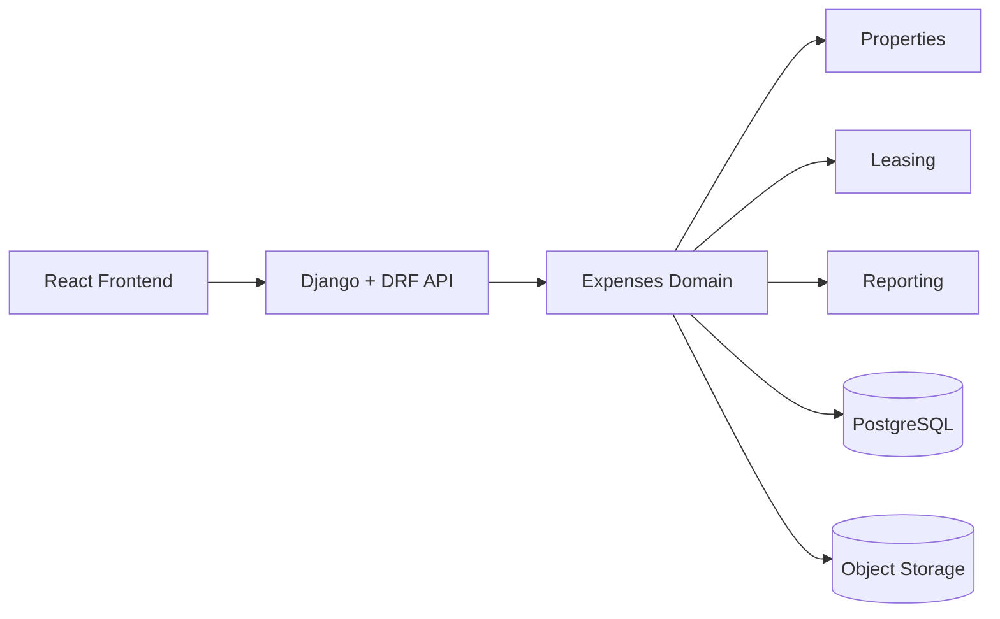

# Expenses Domain Overview

The expenses domain captures what the landlord spent and where that cost belongs.

## Why this domain matters

Expenses explain:
- operating burden by building
- unit-specific repair history
- category trends
- future profitability analysis
