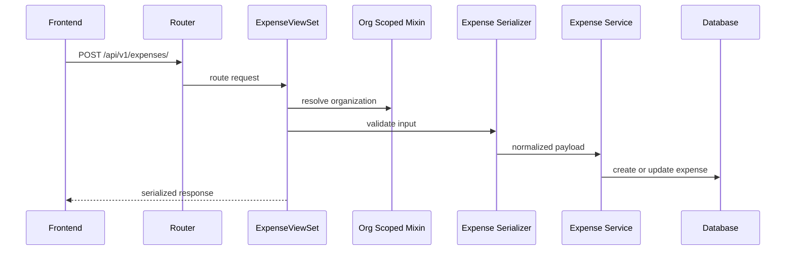
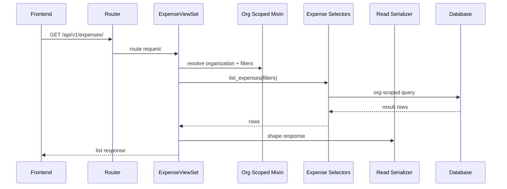

# Expenses Request Lifecycle

## Write flow

```mermaid
sequenceDiagram
    participant FE as Frontend
    participant URL as Router
    participant VIEW as ExpenseViewSet
    participant MIXIN as Org Scoped Mixin
    participant SER as Expense Serializer
    participant SVC as Expense Service
    participant DB as Database

    FE->>URL: POST /api/v1/expenses/
    URL->>VIEW: route request
    VIEW->>MIXIN: resolve organization
    VIEW->>SER: validate input
    SER->>SVC: normalized payload
    SVC->>DB: create or update expense
    VIEW-->>FE: serialized response
```

## Read flow

```mermaid
sequenceDiagram
    participant FE as Frontend
    participant URL as Router
    participant VIEW as ExpenseViewSet
    participant MIXIN as Org Scoped Mixin
    participant SEL as Expense Selectors
    participant SER as Read Serializer
    participant DB as Database

    FE->>URL: GET /api/v1/expenses/
    URL->>VIEW: route request
    VIEW->>MIXIN: resolve organization + filters
    VIEW->>SEL: list_expenses(filters)
    SEL->>DB: org-scoped query
    DB-->>SEL: result rows
    SEL-->>VIEW: rows
    VIEW->>SER: shape response
    VIEW-->>FE: list response
```

## Design intent

The CRUD surface should stay separate from reporting endpoints so the API does not become a junk drawer.
