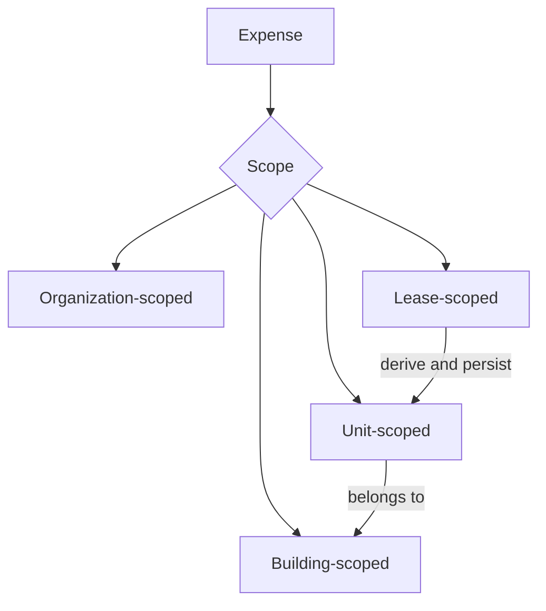
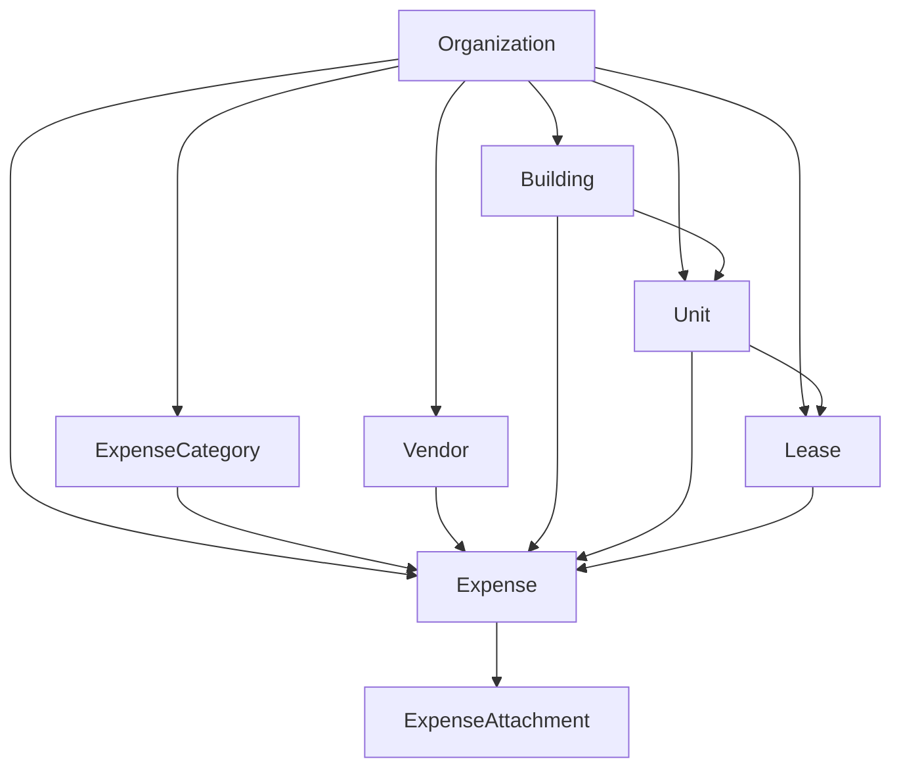

# Expense Scope and Relationships

This is one of the most important design pages in the whole repo.

## Relationship map

## Key design rule

Even if an expense is lease-scoped, reporting should still be able to roll it up by:
- building
- unit
- lease
- category
- time period

That is why deriving and persisting building and unit relationships from the lease is a strong design decision.
