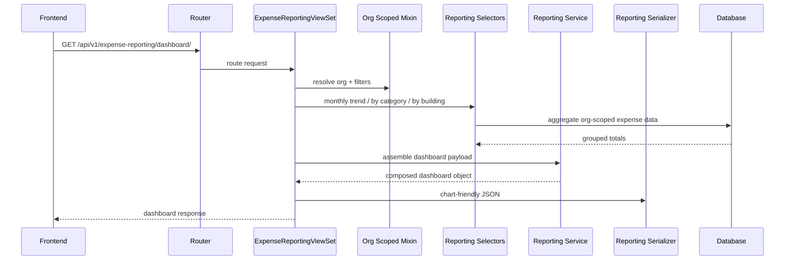

# Expense Reporting and Charting

Reporting deserves its own API surface.

## Reporting targets

- monthly trend
- spend by category
- spend by building
- dashboard cards

## Contract philosophy

- Selectors own deterministic aggregates.
- Serializers own frontend-friendly shapes.
- Services compose combined payloads only when necessary.
