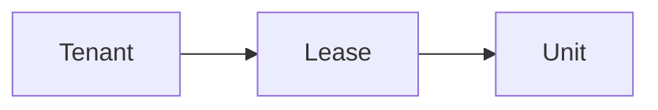

# Leasing Domain Overview

The leasing domain explains *who* is attached to *which unit* and *for what period*.

## Why it matters

The lease is the bridge between:
- people
- space
- money

Billing depends on leases.
Occupancy depends on leases.
Historical context depends on leases.
