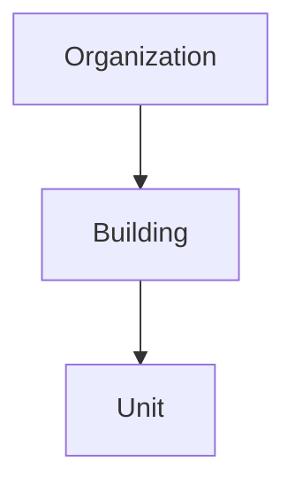

# Properties Domain Overview

The properties domain is the spatial backbone of the product.

## Meaning

- Buildings group units into real-world properties.
- Units are the rentable spaces that leases attach to.
- This domain should remain simple and clean.
- Occupancy should be derived from leases, not stored here as a mutable truth flag.
