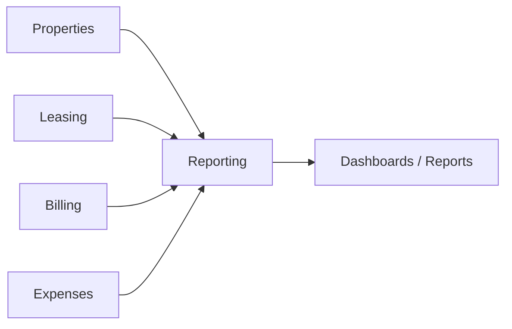

# Reporting Composition

Reporting is downstream of the system’s truth domains.

## Design rule

Reporting should consume structured, deterministic facts.
It should not become the place where core domain truth is invented.
