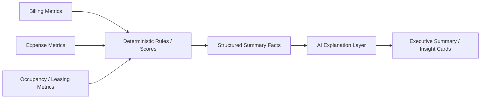

# Executive Summary Pipeline

This page captures the future AI-ready reporting shape.

```mermaid
flowchart LR
    BILL[Billing Metrics]
    EXP[Expense Metrics]
    OCC[Occupancy / Leasing Metrics]
    RULES[Deterministic Rules / Scores]
    FACTS[Structured Summary Facts]
    AI[AI Explanation Layer]
    OUT[Executive Summary / Insight Cards]

    BILL --> RULES
    EXP --> RULES
    OCC --> RULES
    RULES --> FACTS
    FACTS --> AI
    AI --> OUT
```

## Principle

AI should interpret verified facts.
AI should not replace financial truth generation.
