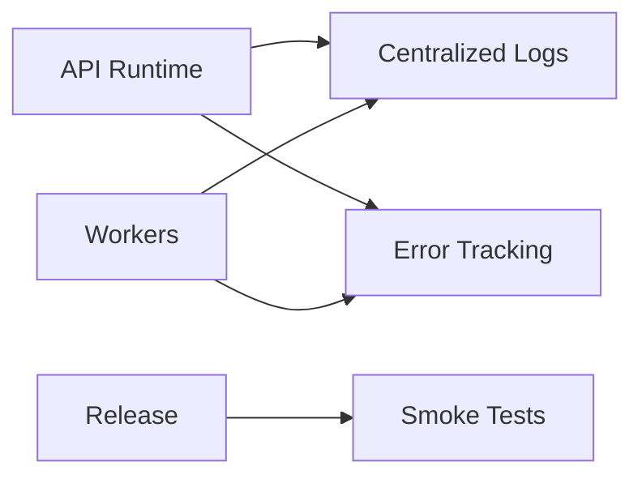

# Observability and Release

## Release minimum

On pull request:
- backend lint + tests
- frontend lint + typecheck
- build check

On merge to staging or main:
- deploy
- run migrations
- smoke-test critical flows
