# EstateIQ / PortfolioOS Diagram Library

This package contains the full diagram set I would want for the project based on the current product, architecture, billing, expenses, reporting, security, and AI direction.

## Diagram index

| # | File | Purpose |
|---|------|---------|
| 1 | `01-system-context.mmd` | High-level runtime map from user to frontend, API, storage, jobs, and data stores. |
| 2 | `02-backend-domain-boundaries.mmd` | Shows modular monolith domain boundaries and key dependencies. |
| 3 | `03-org-scoping-boundary.mmd` | Explains request.org resolution, permission checks, and org-safe queries. |
| 4 | `04-core-entity-relationship.mmd` | Core data model for orgs, buildings, units, leases, billing, and expenses. |
| 5 | `05-frontend-request-lifecycle.mmd` | Shows how frontend API requests move through the layered backend. |
| 6 | `06-auth-session-flow.mmd` | Login, access token, refresh token, and logout lifecycle. |
| 7 | `07-deployment-topology.mmd` | Production deployment shape with app host, DB, Redis, worker, storage, and monitoring. |
| 8 | `08-portfolio-ownership-chain.mmd` | Core ownership chain from organization to lease and tenant. |
| 9 | `09-lease-driven-occupancy.mmd` | Occupancy derived from lease dates, not mutable flags. |
| 10 | `10-ledger-model.mmd` | Charge-payment-allocation model and derived balance principle. |
| 11 | `11-rent-charge-generation-flow.mmd` | Manual, explicit, idempotent monthly charge generation flow. |
| 12 | `12-payment-recording-allocation-flow.mmd` | Payment capture plus explicit or automatic allocation flow. |
| 13 | `13-auto-allocation-strategy.mmd` | Oldest-open-charge-first payment application logic. |
| 14 | `14-delinquency-and-alerts.mmd` | Aging buckets and deterministic billing alert signals. |
| 15 | `15-expenses-context.mmd` | How expenses fit into the overall system and reporting. |
| 16 | `16-expense-scope-model.mmd` | Rules for org, building, unit, and lease scoped expenses. |
| 17 | `17-expense-request-lifecycle.mmd` | Expense CRUD request path through views, services, selectors, and DB. |
| 18 | `18-expense-reporting-flow.mmd` | Reporting endpoint composition for expense charts and dashboards. |
| 19 | `19-dashboard-reporting-composition.mmd` | How billing, expenses, and leasing facts feed reporting surfaces. |
| 20 | `20-audit-event-flow.mmd` | Sensitive mutation to audit log flow. |
| 21 | `21-secure-file-upload-download.mmd` | Secure receipt and lease file handling with private storage and signed URLs. |
| 22 | `22-observability-logging-flow.mmd` | Correlation-aware app, audit, and error logging flow. |
| 23 | `23-scalability-evolution.mmd` | Planned architecture progression from monolith to scaled platform. |
| 24 | `24-building-profitability-inputs.mmd` | Inputs required for trustworthy property profitability views. |
| 25 | `25-executive-summary-pipeline.mmd` | Deterministic summary and PDF/dashboard output pipeline. |
| 26 | `26-ai-explanation-boundary.mmd` | Boundary between core verified math and future AI explanation. |

## 01-system-context.mmd

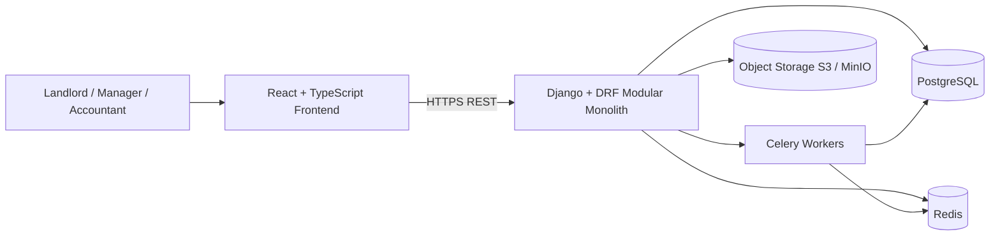

## 02-backend-domain-boundaries.mmd

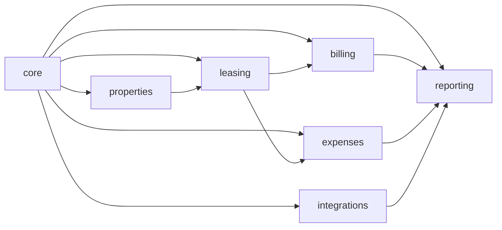

## 03-org-scoping-boundary.mmd

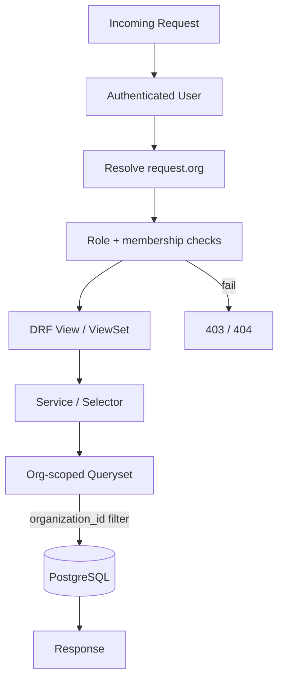

## 04-core-entity-relationship.mmd

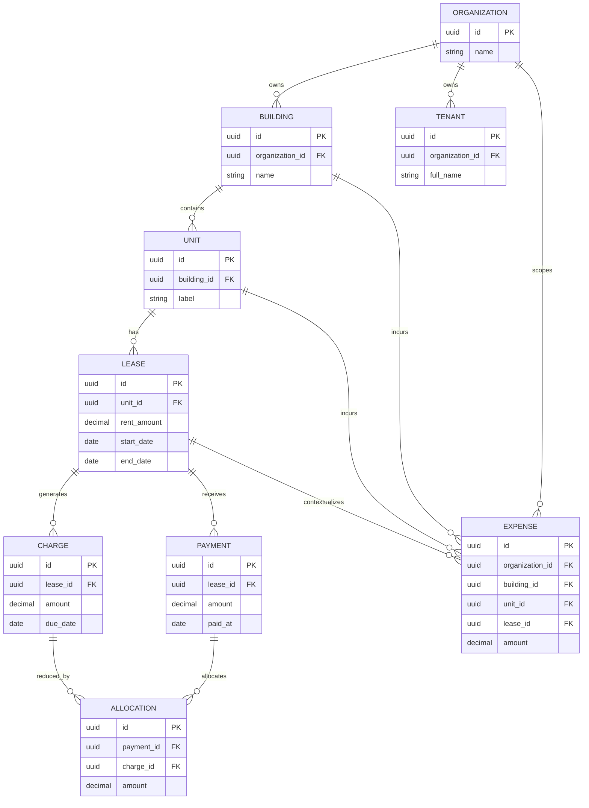

## 05-frontend-request-lifecycle.mmd

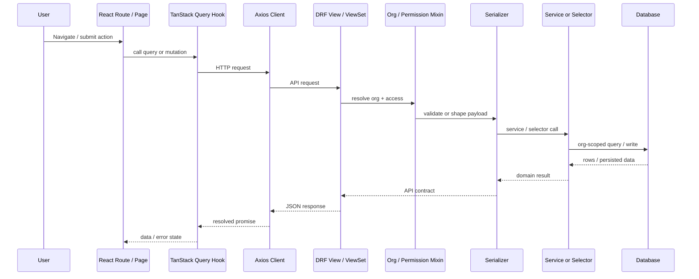

## 06-auth-session-flow.mmd

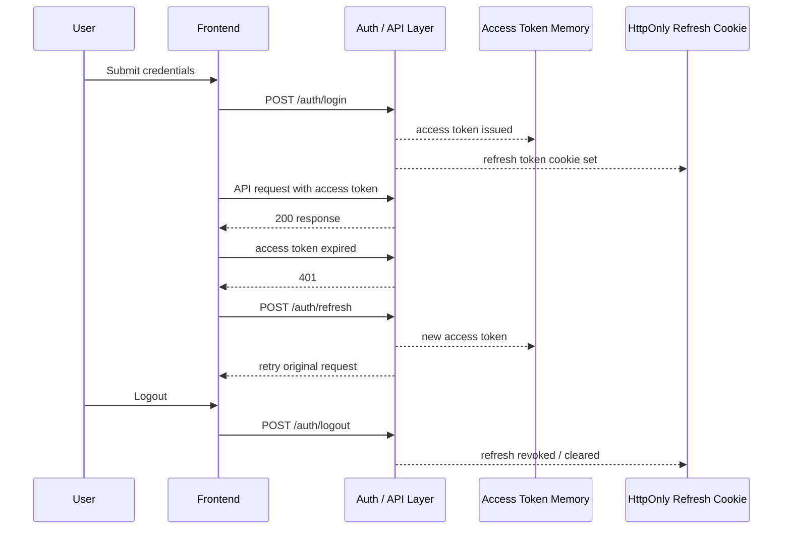

## 07-deployment-topology.mmd

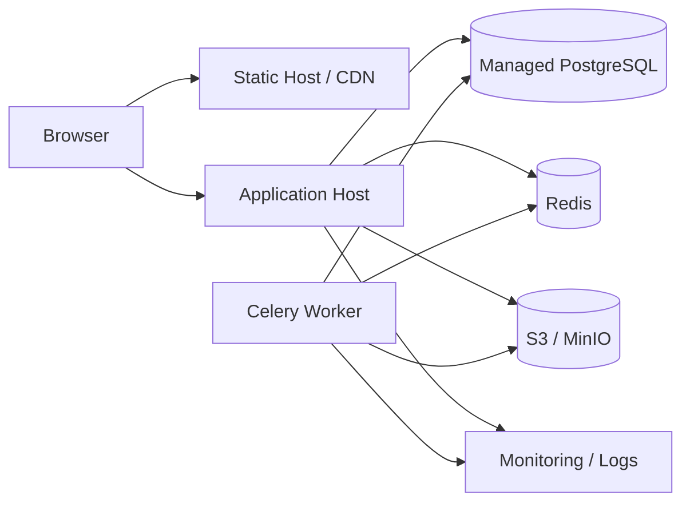

## 08-portfolio-ownership-chain.mmd

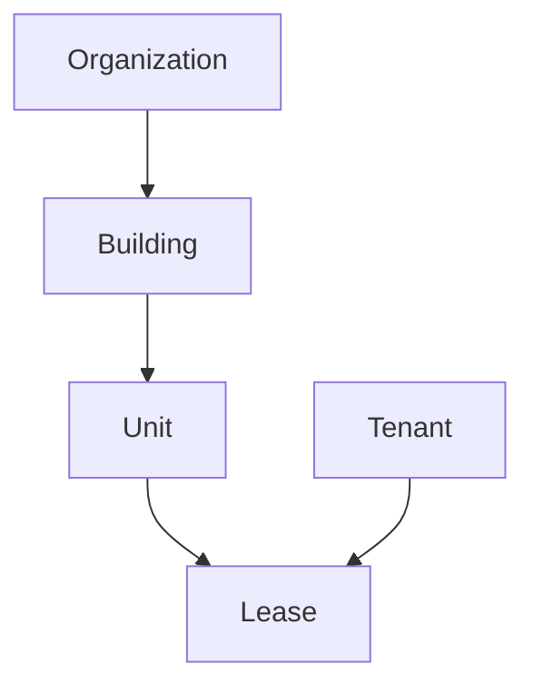

## 09-lease-driven-occupancy.mmd

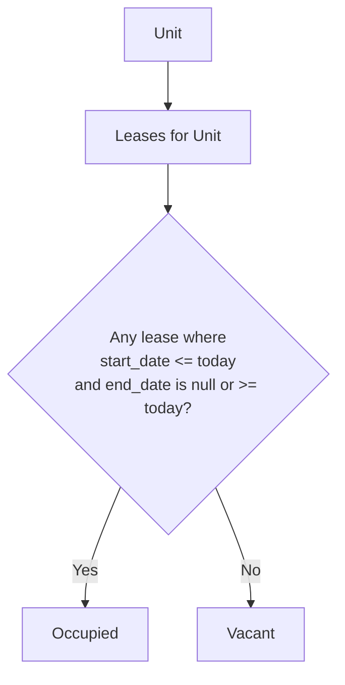

## 10-ledger-model.mmd

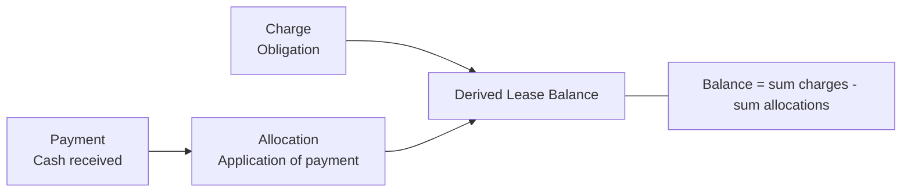

## 11-rent-charge-generation-flow.mmd

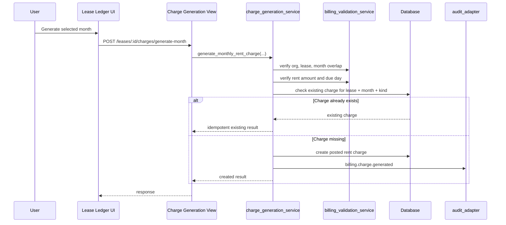

## 12-payment-recording-allocation-flow.mmd

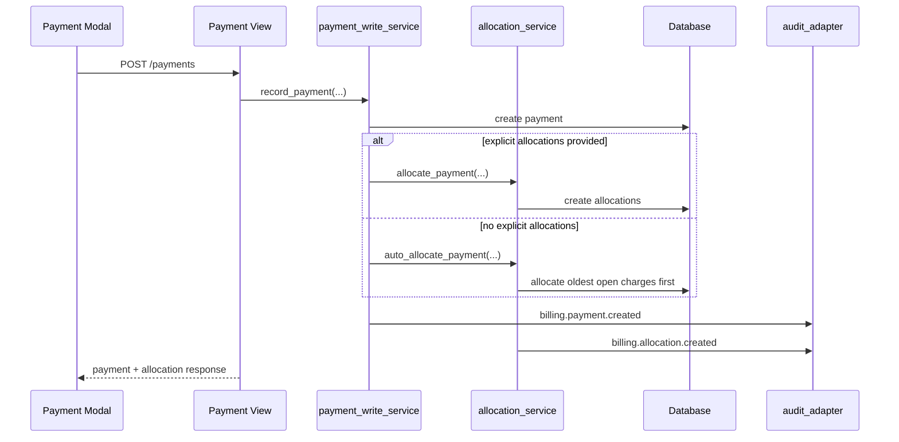

## 13-auto-allocation-strategy.mmd

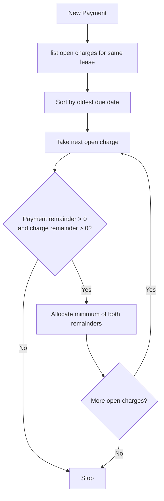

## 14-delinquency-and-alerts.mmd

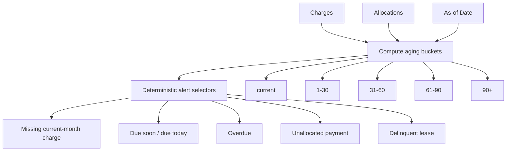

## 15-expenses-context.mmd

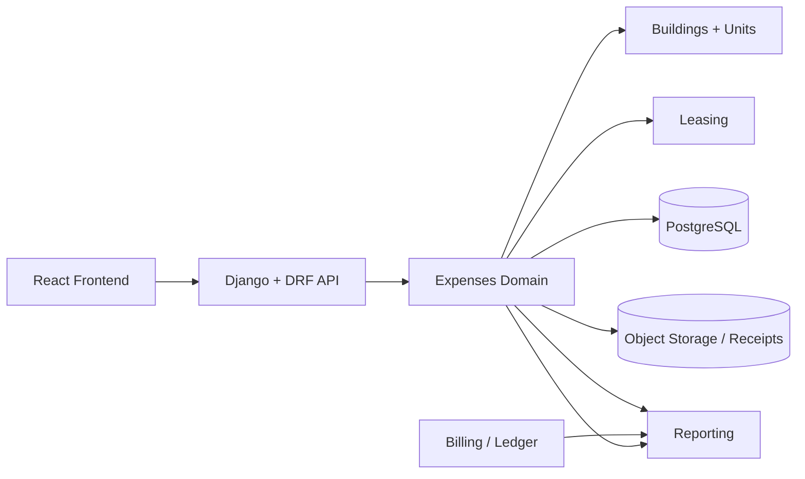

## 16-expense-scope-model.mmd

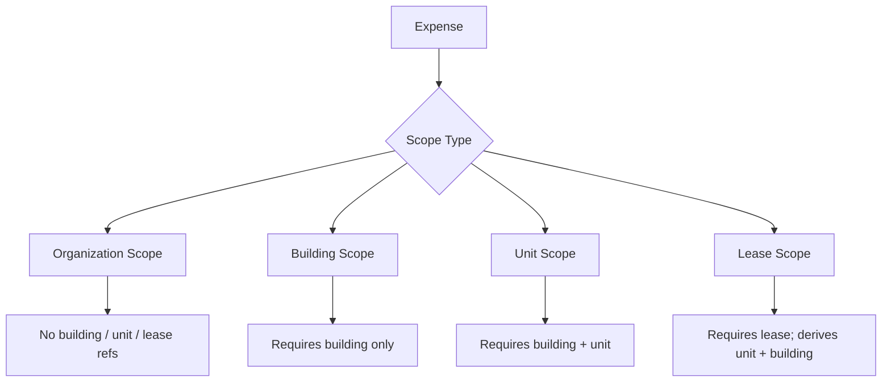

## 17-expense-request-lifecycle.mmd

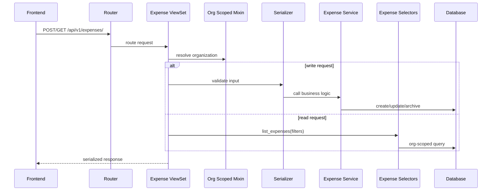

## 18-expense-reporting-flow.mmd

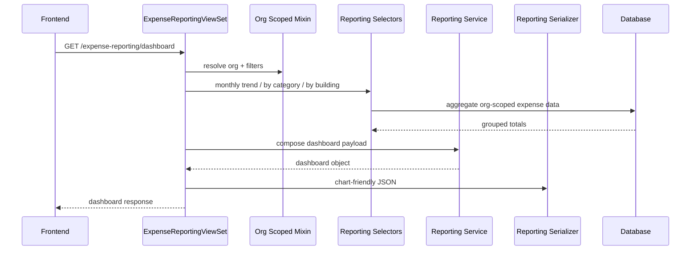

## 19-dashboard-reporting-composition.mmd

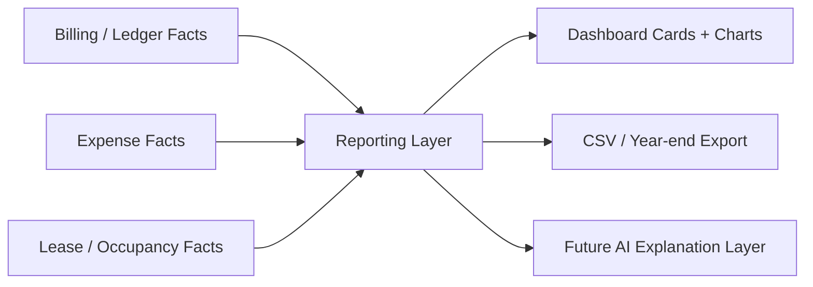

## 20-audit-event-flow.mmd

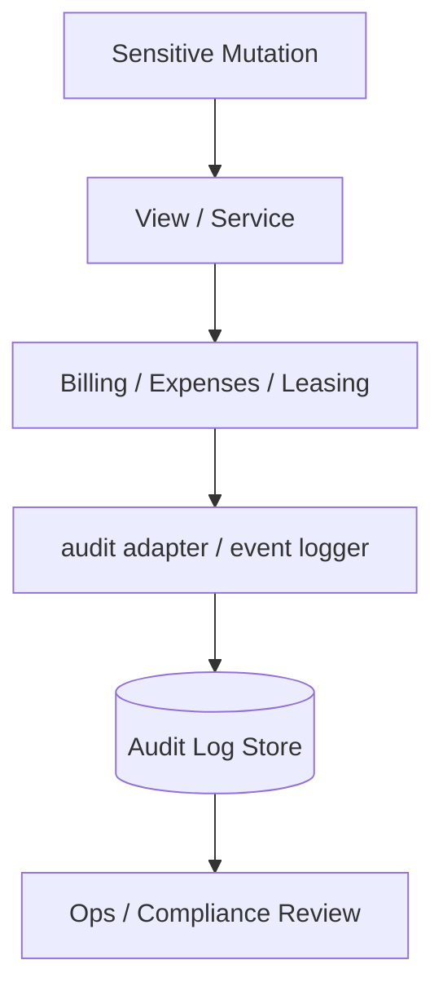

## 21-secure-file-upload-download.mmd

```mermaid
sequenceDiagram
    participant U as User
    participant FE as Frontend
    participant API as DRF API
    participant VAL as File Validation
    participant STORE as Private Object Storage
    participant URL as Signed URL Service

    U->>FE: Upload receipt / lease
    FE->>API: multipart upload
    API->>VAL: validate type + size
    VAL-->>API: pass / reject
    API->>STORE: save private object
    API-->>FE: metadata response

    FE->>API: request file access
    API->>URL: generate signed URL
    URL-->>FE: temporary download URL
```

## 22-observability-logging-flow.mmd

```mermaid
flowchart LR
    REQ[Request / Job]
    CORR[Correlation ID]
    APP[Application Logs]
    AUD[Audit Logs]
    ERR[Error Logs]
    MON[Monitoring / Alerts]
    REVIEW[Developer / Operator]

    REQ --> CORR
    CORR --> APP
    CORR --> AUD
    CORR --> ERR
    APP --> MON
    AUD --> MON
    ERR --> MON
    MON --> REVIEW
```

## 23-scalability-evolution.mmd

```mermaid
flowchart LR
    P1[Phase 1\nModular Monolith]
    P2[Phase 2\nExtract reporting or integrations]
    P3[Phase 3\nRead replicas + projections + horizontal scale]

    P1 --> P2 --> P3
```

## 24-building-profitability-inputs.mmd

```mermaid
flowchart TD
    RENT[Rent / charge collections]
    EXP[Expenses]
    VAC[Vacancy / occupancy context]
    DEBT[Debt / financing later]
    PROF[Per-building profitability view]

    RENT --> PROF
    EXP --> PROF
    VAC --> PROF
    DEBT --> PROF
```

## 25-executive-summary-pipeline.mmd

```mermaid
flowchart LR
    FACTS[Deterministic portfolio metrics]
    RULES[Scoring / anomaly rules]
    SUMMARY[Executive summary payload]
    PDF[Monthly summary PDF]
    DASH[Dashboard insight cards]

    FACTS --> RULES
    FACTS --> SUMMARY
    RULES --> SUMMARY
    SUMMARY --> PDF
    SUMMARY --> DASH
```

## 26-ai-explanation-boundary.mmd

```mermaid
flowchart LR
    LEDGER[Ledger facts]
    EXP[Expense facts]
    REP[Reporting metrics]
    RULES[Deterministic business rules]
    AI[AI explanation layer]
    USER[User-facing insight]

    LEDGER --> REP
    EXP --> REP
    RULES --> REP
    REP --> AI
    AI --> USER

    NOTE[AI interprets verified metrics\nIt does not replace core math]
    AI --- NOTE
```

