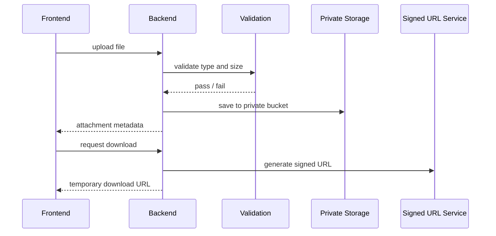

# Secure File Handling

```mermaid
sequenceDiagram
    participant FE as Frontend
    participant API as Backend
    participant VAL as Validation
    participant STORE as Private Storage
    participant URL as Signed URL Service

    FE->>API: upload file
    API->>VAL: validate type and size
    VAL-->>API: pass / fail
    API->>STORE: save to private bucket
    API-->>FE: attachment metadata

    FE->>API: request download
    API->>URL: generate signed URL
    API-->>FE: temporary download URL
```

## Rules

- validate file type and size
- keep buckets private
- use signed URLs for downloads
- consider virus scanning in a later phase
