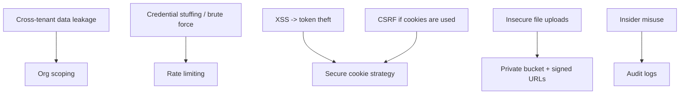

# Threat Model

## Non-negotiables

- organization isolation on every request
- least-privilege roles
- audit logging for sensitive actions
- HTTPS in production
- private file storage with signed URLs
