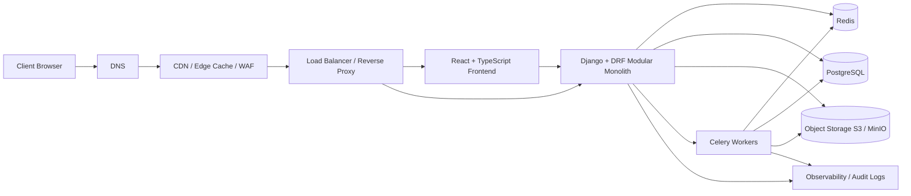

# 01 — System Overview

## Purpose

This document explains the highest-level architecture of PortfolioOS.

It answers a simple question:

**When a landlord opens the app, what systems participate from the browser all the way down to stored financial truth?**

---

## High-level architecture

---

## Plain-English reading of the diagram

### Client

The browser loads the React application, keeps client-side UI state light, and communicates with the backend over HTTPS.

The frontend should not become a second source of truth for financial data.
Its job is to present and orchestrate user interaction, while the backend remains the owner of permissions, validation, and business rules.

### DNS

DNS resolves the product domain to the edge layer.

This is the first infrastructure touchpoint in production.
It does not contain business logic, but it is part of the full system path and should be shown in architecture docs because every real user request begins here.

### CDN / Edge Cache / WAF

The edge layer accelerates static asset delivery, terminates or assists TLS flows depending on deployment shape, and protects the platform from a class of unwanted traffic before requests reach the application layer.

In practice, this layer is the best place for:

- caching the frontend build
- basic traffic filtering
- request normalization
- shielding the origin from noise and spikes

### Load Balancer / Reverse Proxy

The load balancer or reverse proxy routes traffic to the correct runtime.

Typical routing split:

- `/` and frontend asset routes -> React frontend host
- `/api/*` -> Django API

This layer is also responsible for production HTTP concerns such as:

- HTTPS enforcement
- HSTS
- compression
- forwarded headers
- body size limits
- stable origin routing

### React Frontend

The frontend is the interactive client application.

It is responsible for:

- rendering the portfolio UI
- sending authenticated API requests
- managing server-state hydration and caching behavior
- presenting reports, forms, filters, and dashboards

It is **not** responsible for enforcing tenant boundaries or doing financial calculations as a source of truth.

### Django + DRF Modular Monolith

This is the core of the product.

The backend owns:

- authentication and authorization
- organization scoping
- API contracts
- validation
- business workflows
- ledger logic
- expense/reporting orchestration
- integration with storage, cache, and background jobs

This is where the product becomes trustworthy.

### Redis

Redis supports fast, ephemeral infrastructure concerns.

In this architecture it is the right place for:

- short-lived caching
- rate-limit counters
- task brokering for Celery
- lightweight shared runtime state

Redis is not the source of financial truth.
It exists to support speed, resilience, and coordination.

### Celery Workers

Workers handle non-request work.

Examples include:

- scheduled rent generation
- report preparation
- export creation
- future AI-ready summary generation
- retryable background workflows

This keeps the API responsive and makes long-running operations safer to operate.

### PostgreSQL

PostgreSQL is the primary system of record.

This is where the durable business truth lives:

- organizations
- buildings
- units
- tenants
- leases
- charges
- payments
- allocations
- expenses
- reporting inputs

For PortfolioOS, this matters because the product is fundamentally a financial operating system.
The database is not just a storage mechanism.
It is the base layer of trust.

### Object Storage

Object storage is where non-relational files belong.

Examples:

- lease documents
- expense receipts
- exported reports
- future generated PDFs

The application should store references and metadata in the database, while binary files live in private object storage and are served through signed URLs or equivalent secure access patterns.

### Observability / Audit Logs

Production systems need visibility.

This layer includes:

- request logs
- error monitoring
- performance metrics
- immutable audit events for sensitive actions

These concerns are not optional for a financial SaaS.
Without them, the system becomes difficult to trust and difficult to operate.

---

## Architectural summary

PortfolioOS is not best described as “a React app with a Django backend.”

A more accurate description is:

> A multi-tenant financial SaaS platform with a modular monolith core, protected by an edge layer, backed by deterministic data storage, and supported by cache, workers, secure file storage, and production observability.

That framing is what makes the architecture legible to engineers, contributors, and future stakeholders.
