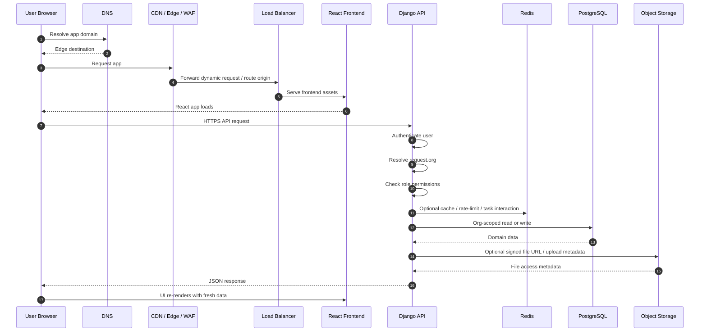

# 02 — Request Flow

## Purpose

This document shows how a typical request moves through the system.

The goal is to make the runtime path explicit, from the user opening the app to the backend returning organization-scoped data.

---

## User request lifecycle

---

## What happens in practice

### 1. The browser loads the app shell

The user hits the product URL.
The browser first resolves the domain, then pulls the frontend bundle from the edge/origin path.

At this stage, the goal is speed and reliability.
The user should get a stable app shell quickly, even before any domain data is loaded.

### 2. The React app hydrates

Once the app bundle loads, React initializes providers, auth/session state, routes, and any initial queries.

This is where the client decides what it needs from the API.
It does **not** decide what the user is allowed to see.

### 3. The frontend makes an HTTPS API call

Typical examples:

- fetch my organization context
- list buildings
- load expenses for a building
- fetch a lease ledger
- load dashboard reporting

All of these should go through a single API client pattern so authentication, headers, retries, and request behavior remain consistent.

### 4. The backend authenticates and resolves org context

This is one of the most important runtime boundaries in the whole product.

The backend must:

- authenticate the request
- resolve the active organization
- enforce permissions for the requested action
- ensure that no queryset escapes the organization boundary

This is the step that turns a generic web request into a valid PortfolioOS request.

### 5. The backend executes domain logic

After the request is trusted, the backend runs the relevant domain path.

Examples:

- read selectors for listing data
- service-layer logic for mutations
- serializer validation for contract enforcement
- reporting aggregation for dashboards

The request should remain thin at the view layer.
Domain rules belong in service and selector boundaries.

### 6. The backend reaches support infrastructure when needed

Some requests also touch supporting systems:

- Redis for cache or runtime coordination
- object storage for receipt/document flows
- Celery dispatch for background tasks

Not every request needs these, but the architecture should make their role clear.

### 7. PostgreSQL returns durable truth

When domain data is required, the API reads from PostgreSQL.

This is the durable source of truth for the financial and operational model.
The API may shape, aggregate, or annotate the data, but it should not replace the underlying truth with unstable shortcuts.

### 8. The response returns as an API contract

The backend sends a stable JSON response back to the frontend.

The frontend then updates the visible UI and its client-side query cache.
The browser becomes current again, but the backend remains authoritative.

---

## Request categories

Not every request behaves the same way.

### Read requests

Examples:

- list buildings
- get lease ledger
- get expenses
- load reporting dashboard

These should emphasize:

- org-scoped query correctness
- eager loading where needed
- predictable response contracts
- fast response times

### Write requests

Examples:

- create lease
- record payment
- create expense
- archive a record

These should emphasize:

- serializer validation
- service-layer business rules
- transactions where needed
- audit events for sensitive mutations

### Background-triggering requests

Examples:

- generate a report export
- trigger monthly charge creation
- run future executive summary jobs

These should emphasize:

- fast acknowledgment from the API
- background execution in workers
- durable logging and retry behavior

---

## Why this matters

A lot of architecture docs stop at boxes and arrows.
That is not enough for a financial system.

In PortfolioOS, the request path matters because it tells you where trust is established:

- not in the browser
- not in query params alone
- not in optimistic UI state
- but in backend authentication, org resolution, permission checks, and deterministic data access

That is the runtime shape contributors need to internalize.
