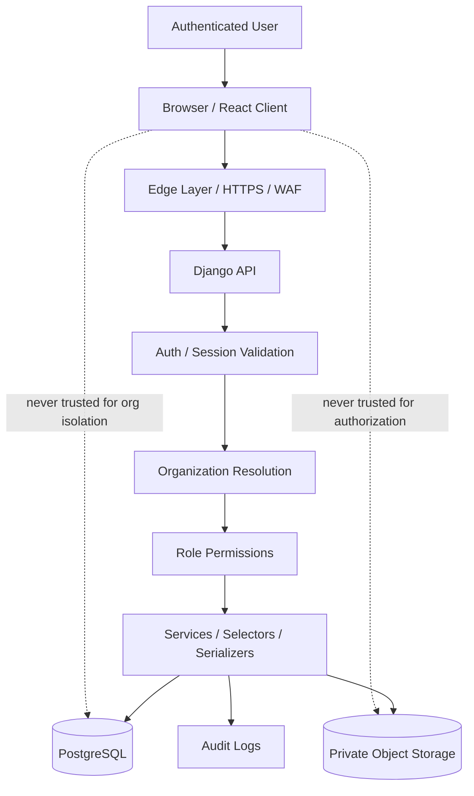

# 03 — Security Boundaries

## Purpose

This document explains where the major trust boundaries exist in PortfolioOS and how requests are constrained so the system remains safe in a multi-tenant financial environment.

---

## Security boundary diagram



---

## Security model in plain English

### The browser is not a trust boundary

The frontend can hold session context and render the right screens, but it is not the final authority on access.

The client can be tampered with.
That means the backend must assume that every request needs real validation.

### HTTPS is required, not optional

All production traffic should be encrypted in transit.

This protects credentials, tokens, and sensitive operational data from passive interception and helps establish a secure baseline before requests reach the app layer.

### Authentication comes before business logic

Before the backend performs any domain work, it must determine whether the request belongs to a real authenticated user or service context.

This is the first application-level trust gate.

### Organization resolution is the central tenant boundary

PortfolioOS is multi-tenant.
That means the most dangerous class of failure is cross-tenant leakage.

Because of that, the backend must reliably resolve the active organization and ensure every queryset and domain operation stays inside that organization.

If this step is weak, the whole system is weak.

### Role permissions shape what authenticated users can actually do

Authentication answers **who are you**.
Authorization answers **what are you allowed to do**.

A valid user still may not have permission to:

- invite members
- mutate lease data
- create payments
- access accounting exports
- change expense records

This boundary needs to be explicit in the docs because multi-tenant safety alone is not enough.

### Domain logic should not bypass security assumptions

Even inside trusted backend code, service functions and selectors should still assume they are operating within organization and permission constraints.

Good architecture does not “forget” security once the request enters the app.
It carries those constraints through the runtime path.

### Database access must stay org-scoped

The database is where the most sensitive data lives.

Examples include:

- tenant contact data
- lease terms
- payment history
- expenses
- uploaded document metadata

The database is not dangerous because it exists.
It becomes dangerous when a query is insufficiently scoped or a code path bypasses expected guards.

### Files need separate protection

Receipts and lease documents are not public assets.

They should live in private object storage and be exposed only through controlled access patterns such as signed URLs, short-lived links, or equivalent secure download flows.

### Audit logs are part of the security story

In a financial system, it is not enough to say that an action was allowed.
You also want a durable record of who did it, when they did it, and what object was touched.

Audit logs support:

- accountability
- debugging
- incident review
- operational trust

---

## Suggested trust model

You can think of the system in these nested trust rings:

```text
Public Internet
  -> Edge protections
    -> Authenticated request
      -> Organization-scoped request
        -> Permission-approved operation
          -> Domain execution
            -> Durable financial state
```

That nesting is important.
A request should earn trust in stages, not receive blanket trust all at once.

---

## Why this matters for PortfolioOS specifically

PortfolioOS is not a casual content app.
It handles:

- financial records
- tenant information
- lease agreements
- reports that influence business decisions

That means the system has to be designed so that the most important risks are controlled by architecture, not by good intentions.

The highest-value security outcome is simple:

> **No user should ever be able to see, mutate, or download data outside the boundaries of their organization and role.**

That principle should be visible in the diagrams, the code, the tests, and the production setup.
