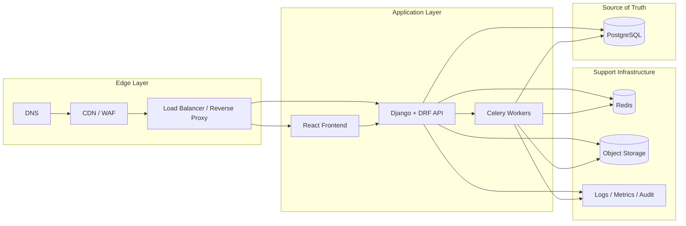

# 04 — Runtime Components

## Purpose

This document explains the runtime responsibility of each major part of the system.

The goal is not just to name components, but to define what each one **owns**, what it **does not own**, and why that separation matters.

---

## Runtime components diagram

---

## Component responsibilities

## 1. Client browser

### Owns

- rendering the user interface
- user interaction
- route transitions
- light local UI state
- client-side query cache behavior

### Does not own

- tenant isolation
- durable financial truth
- authoritative permissions
- core business rules

### Why it exists

The browser is the product surface.
It is where the experience becomes usable.
But it should remain a consumer of trusted backend contracts rather than the origin of trust.

---

## 2. DNS

### Owns

- domain resolution to the edge/origin entrypoint

### Does not own

- application behavior
- access control
- business logic

### Why it exists

DNS is easy to ignore in app docs, but it matters in production because every request begins here.
Including it makes the docs feel like real system docs rather than just codebase docs.

---

## 3. CDN / WAF / Edge cache

### Owns

- fast delivery of static assets
- edge caching policy for safe content
- basic traffic filtering and shielding
- part of the TLS and ingress story

### Does not own

- authenticated business decisions
- data permissions
- financial logic

### Why it exists

This layer improves resilience and keeps unnecessary traffic away from your origin systems.
It is one of the cleanest ways to improve performance and production posture without complicating your domain model.

---

## 4. Load balancer / reverse proxy

### Owns

- traffic routing
- origin selection
- HTTPS enforcement patterns
- proxy headers and request normalization
- request size limits and compression controls

### Does not own

- product domain rules
- org resolution
- persistent business state

### Why it exists

This is the ingress traffic controller.
Without it, production routing and operational controls tend to leak into places they do not belong.

---

## 5. React frontend

### Owns

- product UI composition
- forms, tables, charts, and dashboards
- route-aware data loading
- optimistic UX where appropriate
- API consumption patterns

### Does not own

- final authorization
- persistent ledger math
- cross-tenant protections
- secure file access policy

### Why it exists

The frontend turns domain data into a usable operating system.
For PortfolioOS, this means clean workflows for buildings, leases, billing, expenses, and reporting.

---

## 6. Django + DRF modular monolith

### Owns

- API contracts
- authentication and authorization checks
- organization scoping
- serializer validation
- service-layer business workflows
- selector/query orchestration
- domain boundaries across apps

### Does not own

- long-term binary file storage
- edge routing concerns
- permanent caching as source of truth

### Why it exists

This is the heart of the system.
The backend is where the product becomes deterministic, testable, and trustworthy.

In PortfolioOS, this is especially important because the app is not just CRUD.
It is a financial operating system with consequences attached to correctness.

---

## 7. Redis

### Owns

- fast ephemeral state
- cache support
- rate-limit counters
- worker queue/broker coordination

### Does not own

- authoritative portfolio data
- durable ledger state
- primary reporting truth

### Why it exists

Redis makes the system faster and more operable.
It should support the core platform, not compete with it.

---

## 8. Celery workers

### Owns

- asynchronous jobs
- scheduled work
- retries for safe background workflows
- heavy operations better kept off the request cycle

### Does not own

- user-facing routing
- direct browser interaction
- request-time auth decisions

### Why it exists

Workers let the product scale operationally.
They keep API latency under control while still allowing the system to perform background tasks that matter to the business.

---

## 9. PostgreSQL

### Owns

- durable operational truth
- financial truth
- organization-scoped business records
- constraints and relational integrity

### Does not own

- binary file content
- edge delivery
- short-lived ephemeral cache state

### Why it exists

In PortfolioOS, PostgreSQL is the trust anchor.

This is where the system proves:

- who owns what
- what a tenant owes
- what a landlord spent
- what changed and when
- what can be aggregated into reporting and future AI interpretation

---

## 10. Object storage

### Owns

- receipts
- lease files
- exports
- future generated documents

### Does not own

- relational business constraints
- auth policy by itself
- financial calculations

### Why it exists

Binary documents should not bloat the relational database.
Object storage gives the platform a clean and scalable way to keep supporting files secure and durable.

---

## 11. Observability and audit layer

### Owns

- logs
- error signals
- performance metrics
- request IDs
- immutable audit trails for sensitive actions

### Does not own

- domain rules themselves
- data ownership
- user experience flows

### Why it exists

You cannot operate a production financial SaaS blindly.
This layer makes the system explainable in production and accountable when something goes wrong.

---

## The most important ownership rule

The single most important runtime ownership rule in PortfolioOS is this:

> **PostgreSQL holds the durable truth, Django enforces the rules, React presents the experience, and supporting infrastructure makes the system fast, secure, and operable.**

Once that rule is internalized, the architecture becomes much easier to reason about.
