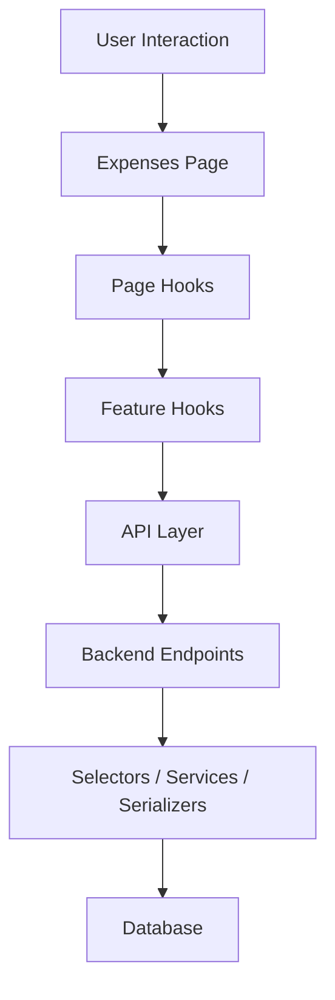

# Expenses Domain Documentation

GitHub-ready documentation for the **EstateIQ Expenses domain**.

This document explains what the Expenses domain is, why it exists, how it is structured, how it interacts with the rest of the application, and how the frontend and backend fit together.

---

## 1. Purpose of the Expenses domain

The Expenses domain exists to model and manage **real operating expenses** across a real estate portfolio.

This is not a generic note-taking system and not a loose “transactions” bucket.

It is meant to support:

- structured expense records
- organization-scoped financial tracking
- reporting across buildings and categories
- archive/unarchive lifecycle behavior
- future financial workflows such as portfolio analytics and broader finance tooling

In EstateIQ, expenses are part of the financial operating layer of the product.

---

## 2. Core responsibilities

The Expenses domain is responsible for:

- creating expense records
- editing expense records
- reading expense records
- soft-archiving expense records
- restoring archived expense records
- exposing category and vendor lookup data
- exposing reporting data for:
  - dashboard summary
  - monthly trends
  - by-category breakdown
  - by-building breakdown

It is **not** responsible for:

- lease billing logic
- rent ledger logic
- payment allocation logic
- tenant-facing payments
- building/unit ownership modeling
- general accounting journal logic

Those belong to separate financial domains.

---

## 3. Domain boundaries

The Expenses domain should remain a clean, bounded vertical slice.

```text
Organization
  ├── Buildings
  │     └── Units
  │           └── Leases
  └── Expenses
        ├── Categories
        ├── Vendors
        ├── Attachments
        └── Reporting
```

Important interpretation:

- buildings, units, and leases provide context for an expense
- they do not define the expense domain itself
- reporting belongs to expenses as a first-class read surface
- archive lifecycle belongs to expenses as a first-class mutation surface

---

## 4. Backend architecture

The backend follows a modular monolith structure with clear separation of concerns.

### Current architectural rules

- thin DRF views
- business logic in services
- query/read logic in selectors
- serializers define API contracts
- reporting is its own API surface
- everything is organization-scoped
- archive behavior is soft-delete style, not hard delete

### Conceptual backend structure

```text
apps/expenses/
├── models/
├── serializers/
├── selectors/
├── services/
├── views/
├── tests/
└── urls / router registration
```

### Layer responsibilities

#### Models
Own persistent expense-related data structures.

#### Serializers
Define input/output API contracts for:
- expense CRUD
- categories
- vendors
- reporting payloads

#### Selectors
Own read/query logic, especially:
- list and detail query composition
- reporting aggregation
- filtered expense reads

#### Services
Own mutation logic, especially:
- create/update expense
- archive
- unarchive

#### Views
Should remain thin orchestration endpoints:
- validate request
- call selector/service
- return serializer output

---

## 5. Backend API surfaces

The Expenses backend is intentionally split into dedicated surfaces.

```text
CRUD
- /expenses/
- /expenses/:id/

Lookups
- /expense-categories/
- /vendors/

Reporting
- /expense-reporting/dashboard/
- /expense-reporting/monthly-trend/
- /expense-reporting/by-category/
- /expense-reporting/by-building/

Actions
- /expenses/:id/archive/
- /expenses/:id/unarchive/
```

### Why this split matters

This keeps the domain clean.

Without this split:
- reporting gets mixed into CRUD
- list endpoints become overloaded
- frontend architecture gets muddled
- future finance surfaces become harder to reason about

With this split:
- CRUD remains record-oriented
- reporting remains aggregate-oriented
- lookup data remains lightweight
- archive behavior remains explicit

---

## 6. Archive behavior

Archive behavior is a core part of the domain.

Expenses are not hard-deleted as the default business flow.

Instead:

- active expenses appear in operational lists
- archived expenses are hidden from normal reporting by default
- archived expenses can be restored
- UI should clearly show archive state to the user

### Why archive exists

Real financial systems often need historical preservation.

An expense may need to be removed from active operational views without being destroyed outright.

That gives the product:
- safer user workflows
- better auditability
- clearer financial history
- reversible cleanup behavior

---

## 7. Reporting model

Reporting is not an afterthought in this domain.

It is one of the main reasons the domain exists.

### Reporting endpoints currently include

- dashboard
- monthly trend
- by category
- by building

### Reporting goals

- summarize total expense activity
- show portfolio-level patterns
- surface operational cost distribution
- support future finance dashboard evolution

### Reporting design principle

Reporting should remain separate from CRUD both:
- in the backend
- in the frontend

That prevents the system from turning into a single giant “expenses endpoint” that does everything badly.

---

## 8. Frontend architecture

The frontend also treats Expenses as a bounded feature slice.

### Current feature structure

```text
src/features/expenses/
├── api/
│   ├── expensesTypes.ts
│   ├── expenseQueryKeys.ts
│   ├── expensesReadApi.ts
│   ├── expensesWriteApi.ts
│   └── expensesReportingApi.ts
├── hooks/
│   ├── useExpenseQueries.ts
│   └── useExpenseMutations.ts
├── components/
│   ├── ExpenseFormPanel.tsx
│   ├── ExpensesTable.tsx
│   ├── ExpenseStatusBadge.tsx
│   └── ExpenseReportingSection/
│       ├── ExpenseReportingSection.tsx
│       ├── ReportingMetricsGrid.tsx
│       ├── ReportingTrendTable.tsx
│       ├── ReportingCategoryTable.tsx
│       ├── ReportingBuildingTable.tsx
│       ├── reportingFormatters.ts
│       └── reportingSelectors.ts
└── pages/
    ├── components/
    ├── hooks/
    ├── utils/
    └── ExpensesPage.tsx
```

### Frontend layer responsibilities

#### `api/`
Owns backend contract knowledge.

- route strings
- request functions
- response normalization
- read/write/reporting separation

#### `hooks/`
Owns React Query integration.

- list/detail queries
- lookup queries
- reporting queries
- mutations
- cache invalidation

#### `components/`
Owns reusable feature UI.

- table
- form
- status badge
- reporting section and subcomponents

#### `pages/`
Owns orchestration.

- page state
- page-level derived data
- page actions
- composition components
- page shell

---

## 9. Frontend orchestration model

The page should act as a conductor, not as the entire orchestra.

### Expenses page flow

```text
ExpensesPage
├── page state hook
├── page data hook
├── page actions hook
├── header
├── filters bar
├── reporting section
└── main content
    ├── form section
    └── table section
```

### Why this matters

A large page file becomes unmaintainable when it tries to own:
- API logic
- query logic
- mutation logic
- data mapping
- formatting
- detailed UI markup

Breaking those apart makes the feature:
- easier to read
- easier to test
- easier to evolve
- easier to debug

---

## 10. Domain data flow



### Read path
```text
User opens page
-> page state builds filters
-> page data hook calls feature queries
-> read/reporting APIs call backend
-> selectors assemble data
-> serializers shape response
-> UI renders list/reporting
```

### Write path
```text
User submits form or archive action
-> page actions hook calls mutation hook
-> write API calls backend
-> service executes business logic
-> response returns updated expense
-> React Query invalidates list/reporting caches
-> UI refreshes
```

---

## 11. Lookup strategy

Categories and vendors are lookup surfaces, not page hacks.

### Why this matters

The form and filter bar both need lightweight supporting data.

That means categories and vendors should be:
- queryable independently
- cacheable
- stable
- not embedded into unrelated endpoints unnecessarily

This keeps the feature more reusable and predictable.

---

## 12. Relationship to other domains

The Expenses domain interacts with other parts of the app, but should not collapse into them.

### Buildings
Expenses may be linked to a building for portfolio context.

### Units
Expenses may be linked to a specific unit where needed.

### Leases
Expenses may eventually be linked to lease context in certain workflows.

### Tenants
Tenants are not the center of the expenses domain. They may be indirectly related, but expense modeling should stay finance-first.

### Finance workspace
Long term, Expenses should likely live under a broader `Finance` workspace alongside:
- lease ledger
- rent charges
- payments
- financial reporting

---

## 13. Why this domain design is strong

### 1. It respects separation of concerns
Read logic, write logic, reporting, and lookups are distinct.

### 2. It matches real product growth
Expenses can expand into a full finance workspace without rewriting the slice.

### 3. It keeps reporting first-class
Reporting is not buried under CRUD hacks.

### 4. It supports safer user workflows
Archive/unarchive preserves history while keeping active views clean.

### 5. It is compatible with enterprise evolution
The structure can support:
- audit logging
- richer finance dashboards
- attachments
- more sophisticated filtering
- future accounting and ledger integration

---

## 14. Suggested documentation companions

This file works best alongside:

- `expenses_page_orchestration.md`
- request lifecycle docs
- entity relationship diagrams
- reporting payload documentation
- frontend integration notes
- audit/event logging notes

---

## 15. Recommended future additions

As the domain matures, add docs for:

### API contract reference
Document exact request/response shapes.

### Reporting payload reference
Document the shape of:
- dashboard metrics
- monthly trend points
- category breakdowns
- building breakdowns

### Attachment lifecycle
If attachments become part of the UI, document:
- upload flow
- list flow
- file metadata expectations

### Audit trail
If audit logging is added, document:
- archive/unarchive events
- create/update events
- org-scoping guarantees

### Finance workspace map
Show how Expenses will relate to:
- income
- charges
- payments
- ledger reporting

---

## 16. Mental model

```text
Buildings tell you where the portfolio is.
Tenants tell you who is in it.
Leases tell you what is agreed.
Expenses tell you what it costs.
Reporting tells you what that cost means.
```
