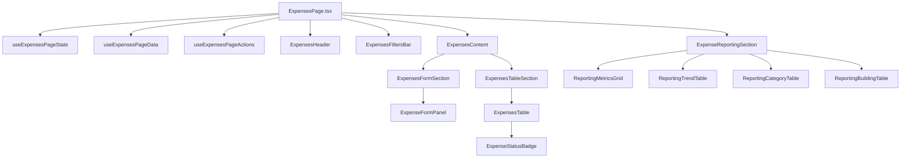
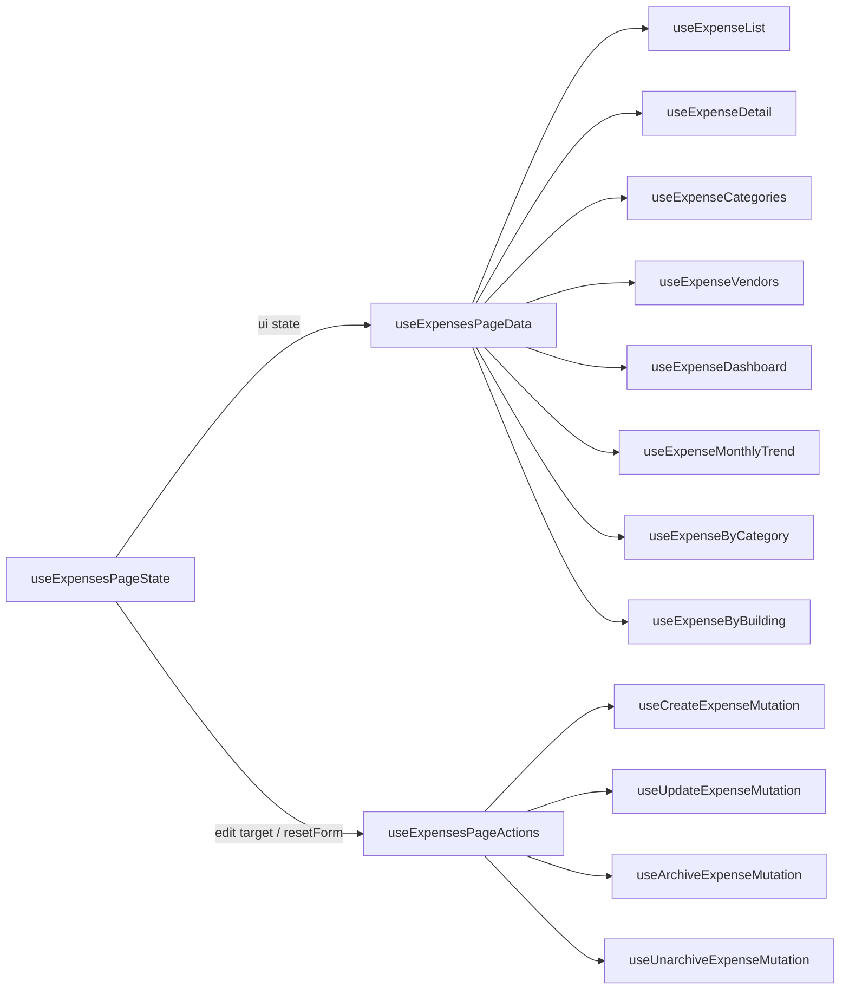
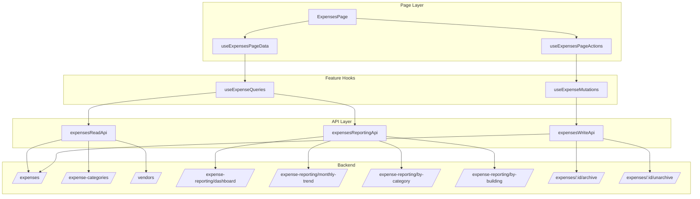
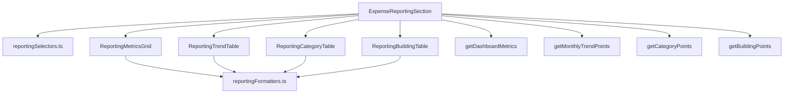
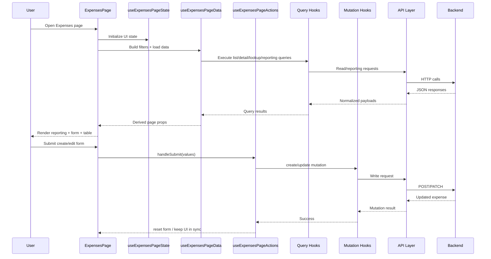

# Expenses Page Orchestration

A GitHub-ready architecture note for the EstateIQ **Expenses** frontend vertical slice.

---

## 1. High-level orchestration



---

## 2. Page composition tree

```text
ExpensesPage
├── useExpensesPageState
├── useExpensesPageData
├── useExpensesPageActions
├── ExpensesHeader
├── ExpensesFiltersBar
├── ExpenseReportingSection
│   ├── ReportingMetricsGrid
│   ├── ReportingTrendTable
│   ├── ReportingCategoryTable
│   └── ReportingBuildingTable
└── ExpensesContent
    ├── ExpensesFormSection
    │   └── ExpenseFormPanel
    └── ExpensesTableSection
        └── ExpensesTable
            └── ExpenseStatusBadge
```

---

## 3. Hook orchestration map



---

## 4. Hook responsibilities

## `useExpensesPageState`
Owns page-local UI state.

- `searchInput`
- `selectedCategoryId`
- `selectedVendorId`
- `showArchivedOnly`
- `editingExpenseId`
- `resetForm()`

## `useExpensesPageData`
Owns query composition and derived values.

- builds `listFilters`
- builds `reportingFilters`
- calls all list/detail/lookup/reporting hooks
- derives:
  - `expenses`
  - `totalExpenseCount`
  - `categories`
  - `vendors`
  - `formMode`
  - `formInitialValues`
  - `isReportingLoading`
  - `reportingErrorMessage`
  - `listErrorMessage`
  - `hasLookupError`

## `useExpensesPageActions`
Owns mutation-backed page behavior.

- `handleSubmit`
- `handleEdit`
- `handleArchive`
- `handleUnarchive`
- submit/loading/error aggregation
- edit reset behavior after relevant mutations

---

## 5. Query and mutation layering



---

## 6. Reporting section decomposition



### Why this split is good
- keeps reporting orchestration thin
- keeps formatting logic out of JSX
- keeps selector/data-shaping logic out of render code
- makes future chart upgrades isolated instead of invasive

---

## 7. Page data flow



---

## 8. Create / edit / archive flows

### Create flow
```text
ExpensesPage
  -> ExpensesFormSection
    -> ExpenseFormPanel
      -> onSubmit(values)
        -> useExpensesPageActions.handleSubmit
          -> useCreateExpenseMutation
            -> expensesWriteApi.createExpense
```

### Edit flow
```text
ExpensesTable
  -> onEdit(expense)
    -> useExpensesPageActions.handleEdit
      -> setEditingExpenseId(expense.id)
        -> useExpensesPageData
          -> useExpenseDetail(editingExpenseId)
            -> mapExpenseToFormValues(detail)
              -> ExpenseFormPanel initialValues
```

### Archive flow
```text
ExpensesTable
  -> onArchive(expense)
    -> useExpensesPageActions.handleArchive
      -> useArchiveExpenseMutation
        -> expensesWriteApi.archiveExpense
          -> invalidate expense list + reporting caches
```

### Unarchive flow
```text
ExpensesTable
  -> onUnarchive(expense)
    -> useExpensesPageActions.handleUnarchive
      -> useUnarchiveExpenseMutation
        -> expensesWriteApi.unarchiveExpense
          -> invalidate expense list + reporting caches
```

---

## 9. File map

```text
src/features/expenses/
├── api/
│   ├── expensesTypes.ts
│   ├── expenseQueryKeys.ts
│   ├── expensesReadApi.ts
│   ├── expensesWriteApi.ts
│   └── expensesReportingApi.ts
├── hooks/
│   ├── useExpenseQueries.ts
│   └── useExpenseMutations.ts
├── components/
│   ├── ExpenseFormPanel.tsx
│   ├── ExpensesTable.tsx
│   ├── ExpenseStatusBadge.tsx
│   └── ExpenseReportingSection/
│       ├── ExpenseReportingSection.tsx
│       ├── ReportingMetricsGrid.tsx
│       ├── ReportingTrendTable.tsx
│       ├── ReportingCategoryTable.tsx
│       ├── ReportingBuildingTable.tsx
│       ├── reportingFormatters.ts
│       └── reportingSelectors.ts
└── pages/
    ├── components/
    │   ├── ExpensesHeader.tsx
    │   ├── ExpensesFiltersBar.tsx
    │   ├── ExpensesContent.tsx
    │   ├── ExpensesFormSection.tsx
    │   └── ExpensesTableSection.tsx
    ├── hooks/
    │   ├── useExpensesPageState.ts
    │   ├── useExpensesPageData.ts
    │   └── useExpensesPageActions.ts
    ├── utils/
    │   ├── expensePageErrors.ts
    │   └── expensePageMappers.ts
    └── ExpensesPage.tsx
```

---

## 10. Architecture notes

## What is good about this design

### 1. The page is becoming a real orchestration layer
`ExpensesPage.tsx` should mostly assemble the experience, not contain all business details inline.

### 2. Reporting is treated as a first-class surface
It is not collapsed into CRUD. That matches the backend and prevents messy UI coupling.

### 3. Mutations and queries are clearly separated
That keeps feature hooks readable as the slice grows.

### 4. Reusable leaf components stay reusable
`ExpenseFormPanel`, `ExpensesTable`, and `ExpenseStatusBadge` remain feature components, not page-only hacks.

### 5. Page-level concerns are isolated
State, data derivation, and action orchestration are now split into dedicated page hooks.

---

## 11. Suggested cleanup checkpoints

- Remove any stale top-level `ExpenseReportingSection.tsx` file outside the folder version
- Normalize `ExpensesStatusBadge.tsx` to `ExpenseStatusBadge.tsx`
- Remove or repurpose any leftover `expensesApi.ts` barrel file if it duplicates the split API layer
- Tighten remaining temporary page-level types after the compile pass
- Wire route + nav cleanly once the compile/debug pass is green

---

## 12. Future evolution

This structure can expand cleanly into:

- richer filter handling
- pagination/search polish
- attachment UI
- finance workspace landing page
- charts replacing some tables
- lease/payment/ledger integration under a broader `Finance` workspace

---

## 13. Mental model

```text
ExpensesPage is the conductor.
Page hooks provide the sheet music.
Feature hooks talk to the backend.
Leaf components play one instrument each.
Reporting has its own section instead of fighting CRUD for attention.
```
