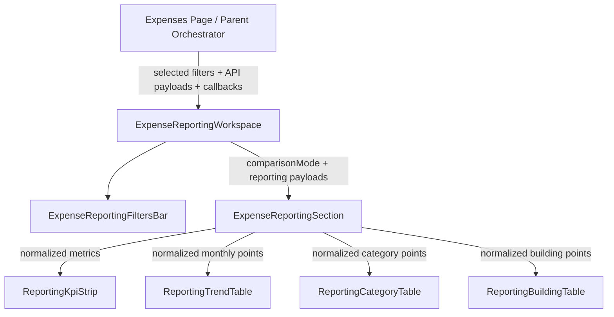
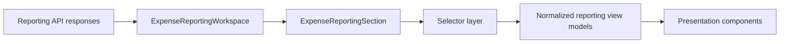
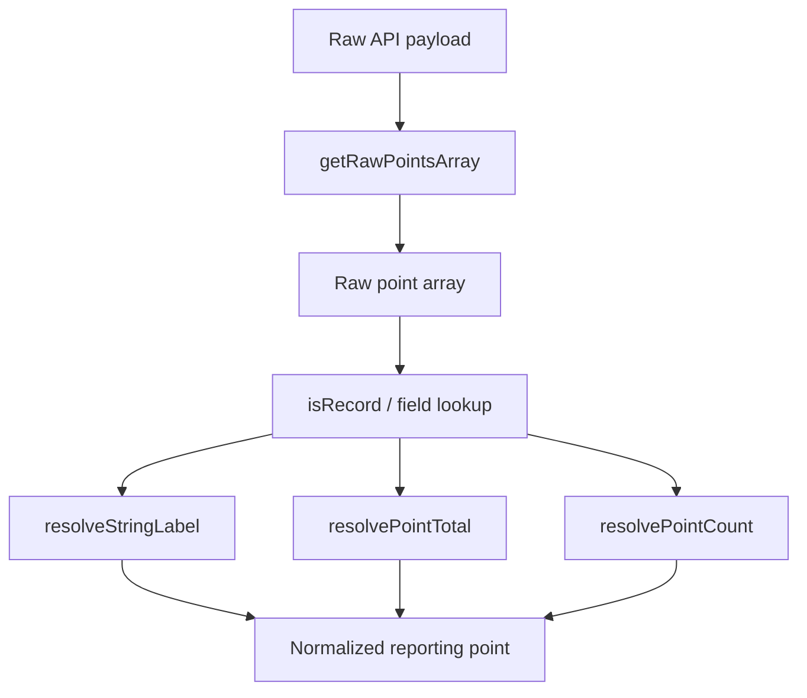
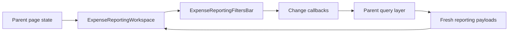

# Expense Reporting Orchestration

## Purpose

This document explains how the `expenses/reporting` slice works in PortfolioOS, how data moves through the reporting workspace, where normalization happens, and what the intended production architecture should be.

This reporting slice is designed to keep the UI deterministic and trustworthy:

- backend APIs provide structured reporting payloads
- selector modules normalize unstable payload shapes into UI-safe view models
- components render normalized data only
- formatting stays presentation-only
- orchestration is kept at the workspace boundary

The reporting layer is intentionally **read-model focused**. It does not mutate expenses. It exists to interpret structured expense data already owned by the expense domain.

---

## Why this slice exists

The expenses page has two different jobs:

1. **Records** — create, edit, archive, and review expense entries
2. **Reporting** — summarize, compare, and explain expense patterns

This slice handles only the second job.

That separation matters because reporting has a different shape:

- more derived data
- more view-model normalization
- more tolerance for backend payload drift during iteration
- stronger need for chart-safe numbers and stable labels

---

## High-level responsibility split

### Workspace orchestration

`ExpenseReportingWorkspace.tsx` is the public orchestration boundary for the reporting experience.

It owns:

- filter bar composition
- local comparison mode state (`category` vs `building`)
- passing fetched reporting payloads downward
- wiring loading and error surfaces into the reporting section

It does **not** own:

- fetching logic
- payload normalization
- display formatting
- table or chart internals

### Section composition

`ExpenseReportingSection.tsx` is the reporting composition layer.

It owns:

- converting API payloads into normalized UI-safe shapes through selectors
- rendering KPI strip + trend view + active comparison view
- state surfaces for loading, empty, and error conditions

It does **not** own:

- page-level orchestration
- filter state
- route state
- API concerns

### Presentation components

The table/chart components are display-only surfaces:

- `ReportingKpiStrip.tsx`
- `ReportingTrendTable.tsx`
- `ReportingCategoryTable.tsx`
- `ReportingBuildingTable.tsx`
- `ReportingMetricsGrid.tsx` (if retained as a layout or KPI surface)
- `ExpenseReportingFiltersBar.tsx`

These components should consume **normalized reporting types**, not raw backend payload shapes.

### Selector layer

The selector layer is the most important internal seam in this slice.

It owns:

- raw payload extraction
- numeric coercion
- label fallbacks
- summary fallback logic
- normalized reporting point creation
- debug instrumentation for contract mismatches

This is the defensive boundary between the backend contract and the UI.

### Formatters

`reportingFormatters.ts` owns presentation formatting only:

- currency formatting
- number formatting

It must not know how to interpret backend payload shapes.

---

## Recommended production folder structure

```text
src/features/expenses/reporting/
├── components/
│   ├── ExpenseReportingWorkspace.tsx
│   ├── ExpenseReportingSection.tsx
│   ├── ExpenseReportingFiltersBar.tsx
│   ├── ReportingKpiStrip.tsx
│   ├── ReportingTrendTable.tsx
│   ├── ReportingCategoryTable.tsx
│   ├── ReportingBuildingTable.tsx
│   └── ReportingMetricsGrid.tsx
├── selectors/
│   ├── reportingDashboardSelectors.ts
│   ├── reportingBreakdownSelectors.ts
│   ├── reportingPayloadUtils.ts
│   ├── reportingNumberUtils.ts
│   ├── reportingDebug.ts
│   └── index.ts
├── formatters/
│   └── reportingFormatters.ts
└── index.ts
```

### Transitional note

At the time of this document, the slice may still be in a **transitional refactor state**, where some selector logic remains in a larger `reportingSelectors.ts` file and some imports still reference `utils/`.

That is acceptable during migration, but the intended finish line is:

- selector logic under `selectors/`
- a single selector barrel export
- normalized reporting types crossing into components
- no raw selector debug logging in components

---

## Component orchestration map



### Reading this diagram

- the **parent page** owns server-state fetching and filter state persistence
- the **workspace** owns local reporting-mode orchestration
- the **section** owns normalization + composition
- the **child renderers** own presentation only

---

## Runtime data flow



### Flow explained

1. the parent page fetches dashboard/trend/category/building payloads
2. the workspace passes those payloads into the reporting section
3. the reporting section calls selectors
4. selectors normalize raw payloads into stable UI shapes
5. presentation components render the normalized shapes

That separation is the whole point of this slice.

---

## Selector pipeline

The selector layer should be split by responsibility.

### `reportingNumberUtils.ts`

Owns low-level defensive helpers:

- `isRecord(...)`
- `toSafeNumber(...)`
- `getFirstDefinedValue(...)`
- `getFirstDefinedKey(...)`
- `resolveStringLabel(...)`
- `resolvePointTotal(...)`
- `resolvePointCount(...)`

This is where stringified decimals, missing fields, numeric strings, and alias-based field resolution are handled.

### `reportingPayloadUtils.ts`

Owns payload-shape extraction:

- `getRawPointsArray(...)`
- `getDashboardSummarySource(...)`

This exists because backend reporting payloads may temporarily vary between:

- `points`
- `results`
- `items`
- `data`

### `reportingDashboardSelectors.ts`

Owns KPI metric normalization:

- `normalizeDashboardMetric(...)`
- `getDashboardMetrics(...)`
- `isMoneyMetric(...)`

It should prefer backend-provided metrics when present and synthesize fallback metrics from dashboard summary fields only when necessary.

### `reportingBreakdownSelectors.ts`

Owns normalized point creation for chart/table surfaces:

- `getMonthlyTrendPoints(...)`
- `getCategoryPoints(...)`
- `getBuildingPoints(...)`

Produces normalized output types such as:

- `ReportingMonthlyTrendPoint`
- `ReportingCategoryPoint`
- `ReportingBuildingPoint`

### `reportingDebug.ts`

Owns gated selector diagnostics.

This is where contract debugging should live, not inside React components.

---

## Selector normalization diagram



### Why this matters

This is the exact seam that protects the UI from backend contract drift.

If the backend sends a label field correctly but changes the numeric field name, the selector can still produce a row name while incorrectly normalizing totals to `0`.

That is why:

- numeric field resolution must be centralized
- debug instrumentation must be centralized
- components must not contain their own fallback coercion logic

---

## Current known contract risk

The main risk in this slice is **type and field-name drift** between raw API payloads and normalized reporting point types.

Typical failure mode:

- labels appear correctly
- totals or counts show up as `0`
- charts render, but the underlying numbers are wrong

That usually means the selector alias list does not match the backend field name.

### Example of defensive alias resolution

The selector layer should resolve totals from candidate keys such as:

- `total`
- `amount`
- `value`
- `total_amount`
- `expense_total`

And counts from candidate keys such as:

- `count`
- `expense_count`
- `item_count`
- `total_count`

If the backend introduces a different field name, selectors should expose that quickly through gated debug logs.

---

## Presentation contract

The rendering components should consume only normalized, chart-safe data.

### KPI strip

`ReportingKpiStrip.tsx` should receive:

- `ReportingDashboardMetric[]`

Responsibilities:

- render a compact metric strip
- format currency vs count correctly
- handle sparse metric sets gracefully

### Trend chart/table

`ReportingTrendTable.tsx` should receive:

- `ReportingMonthlyTrendPoint[]`

Responsibilities:

- render a clean month-over-month trend surface
- stay layout-safe with a fixed-height chart wrapper
- never interpret raw API payloads directly

### Category comparison

`ReportingCategoryTable.tsx` should receive:

- `ReportingCategoryPoint[]`

Responsibilities:

- sort categories by normalized total
- compute shares based on normalized totals
- hide exact-detail rows behind a toggle when desired

### Building comparison

`ReportingBuildingTable.tsx` should receive:

- `ReportingBuildingPoint[]`

Responsibilities:

- sort buildings by normalized total
- compute shares based on normalized totals
- provide an expandable details view without owning data normalization

---

## Important design rule: no duplicate coercion in components

A temporary anti-pattern to avoid is placing a local `toSafeNumber(...)` function inside a table component.

That weakens the selector boundary and spreads contract logic across the UI.

The preferred rule is simple:

- selectors normalize
- components render

If a component needs a safe number, the selector layer should have already produced it.

---

## Filter orchestration

`ExpenseReportingFiltersBar.tsx` is a UI control surface for reporting filters.

It should remain a presentational control component.

It receives:

- selected scope
- selected category/vendor/building/unit ids
- category/vendor/building/unit option collections
- change callbacks from the parent

It may compute display labels for active pills, but it should not own:

- API fetching
- query invalidation
- reporting normalization
- cross-feature orchestration

### Filter relationships



This keeps the filter bar reusable and prevents data logic from leaking into the component tree.

---

## Loading, empty, and error states

The reporting section should provide a stable state machine for the reporting workspace.

### Loading state

Used when reporting queries are in flight.

Goal:

- show a calm skeleton or loading panel
- preserve layout shape
- avoid flashing incomplete charts

### Error state

Used when reporting queries fail.

Goal:

- show a human-readable error card
- keep scope narrow to the reporting workspace
- avoid page-wide instability

### Empty state

Used when a valid query returns no reporting data.

Goal:

- show a quiet, intentional empty surface
- make it obvious that the filter set may be too narrow
- avoid making “no data” look like a bug

---

## Debugging strategy

Debugging belongs in the selector boundary.

### Good debug locations

- API layer: request params + raw payload
- selector layer: raw points, resolved field keys, normalized output

### Bad debug locations

- child chart components
- KPI strip
- random `console.log(...)` calls inside React render paths

### Production-safe debug rules

- debug logs gated behind `import.meta.env.DEV`
- optional feature flag such as `VITE_ENABLE_REPORTING_DEBUG`
- no permanent noisy logs in committed UI components

---

## Current vs target architecture

### Current transitional shape

In a transitional state, the slice may still contain:

- a larger `reportingSelectors.ts` file that mixes multiple responsibilities
- component-level debug logging
- raw API point types leaking into a table component
- duplicated numeric coercion helpers inside a component

### Target production shape

The target state is:

- selectors split by responsibility
- one selector barrel export
- components consume normalized types only
- formatting isolated to a formatter module
- debug instrumentation isolated to selector utilities
- workspace and section remain slim orchestration layers

---

## Architecture principles this slice follows

### 1. Deterministic UI over raw payloads

The UI should not trust raw backend payloads directly.

### 2. Thin orchestration layers

Workspace and section components should mostly compose, not think.

### 3. Defensive normalization boundary

The selector layer is the contract hardening seam.

### 4. Presentation-only child components

Tables and charts should be easy to reason about when read in isolation.

### 5. Structured data first, interpretation second

This is aligned with the broader PortfolioOS philosophy:

- the system computes structured numbers first
- UI explains those numbers second
- later AI insights can sit on top of the same deterministic reporting models

---

## Suggested import rules

To keep the slice clean, use these import conventions.

### Components

Components should import from:

- `../selectors`
- `../formatters/reportingFormatters`

They should not import raw backend point types unless the component is explicitly the normalization boundary.

### Selector files

Selector files may import from:

- `../../api/expensesTypes`
- sibling selector helpers

They should not import React or UI components.

### Formatters

Formatters should import nothing from selectors.

They are pure display helpers.

---

## Future improvements

### Near-term

- move all selector files into `selectors/`
- replace the large compatibility selector file with a barrel-only export
- remove component-level debug logging
- update any remaining table components to consume normalized reporting point types only

### Medium-term

- add small selector tests for payload alias handling
- add storybook or visual snapshots for reporting state surfaces
- add query-layer instrumentation for reporting endpoints

### Longer-term

- add richer trend and anomaly cards on top of the same normalized reporting models
- add building-level drilldown without breaking the selector boundary
- use the same normalized reporting structures as the deterministic base for future AI insight cards

---

## File-by-file summary

### `ExpenseReportingWorkspace.tsx`
Public orchestration boundary for the reporting workspace.

### `ExpenseReportingFiltersBar.tsx`
Presentational filter controls for scope and lookup dimensions.

### `ExpenseReportingSection.tsx`
Composition layer that normalizes payloads and renders reporting surfaces.

### `ReportingKpiStrip.tsx`
Compact summary metric renderer.

### `ReportingTrendTable.tsx`
Month-over-month trend surface.

### `ReportingCategoryTable.tsx`
Category comparison renderer.

### `ReportingBuildingTable.tsx`
Building comparison renderer.

### `reportingFormatters.ts`
Pure presentation formatting helpers.

### `selectors/*`
Normalization, payload extraction, and debug instrumentation.

---

## Final takeaway

This reporting slice works best when treated as a small read-model system:

- **parent page fetches**
- **workspace orchestrates**
- **section normalizes**
- **components render**
- **formatters present**

That is the clean mental model.

When this structure is respected, the slice becomes easier to:

- debug
- extend
- hand off
- test
- harden for production

And that is exactly what we want for PortfolioOS.
