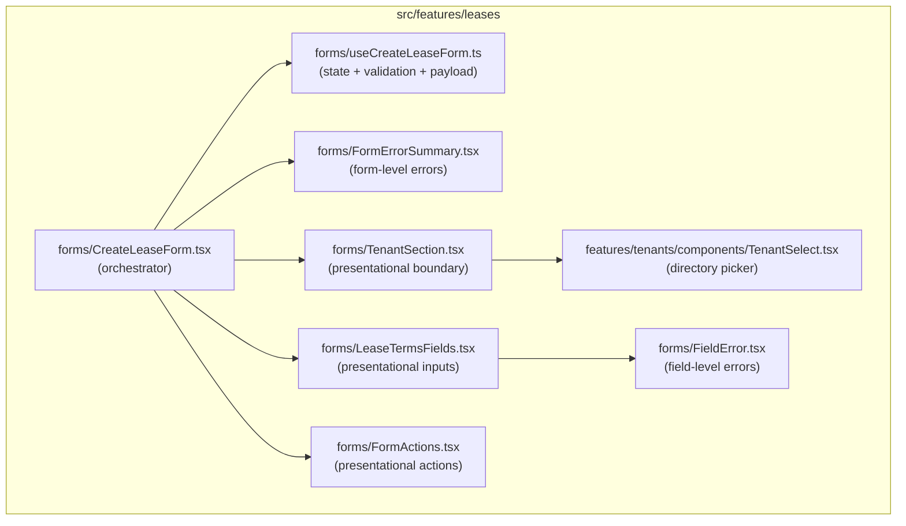
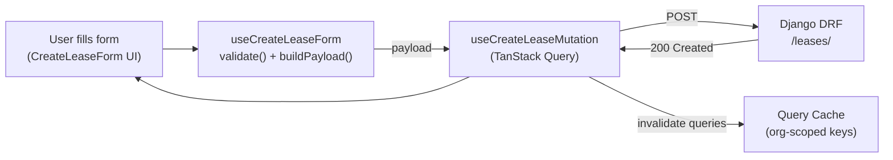
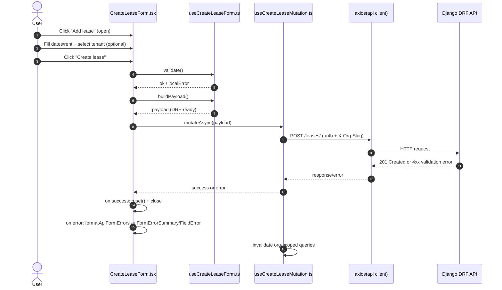
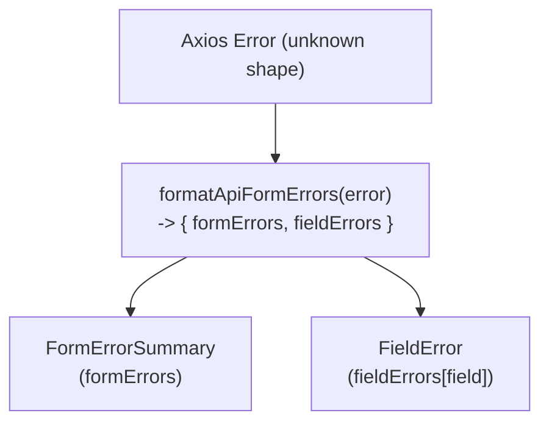
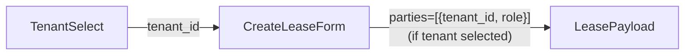
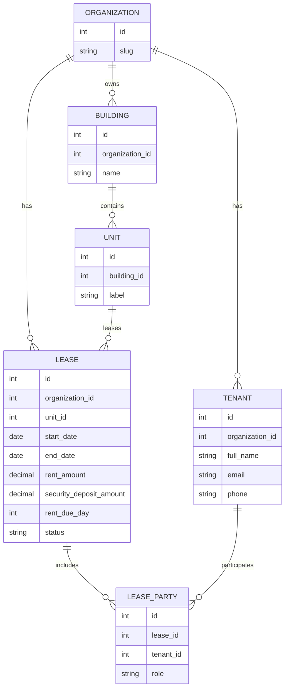
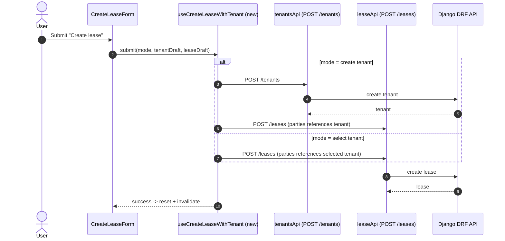

# Create Lease Flow — Architecture Diagram (UI + Data Flow)

This doc explains how the **Create Lease** experience is orchestrated in the frontend, from **UI components** → **state hooks** → **TanStack Query mutations** → **Django DRF API**.

> **Scope:** current refactor state (select existing tenant only).  
> **Next phase:** inline “create tenant” mode (POST tenant → POST lease) will extend the same architecture.

---

## Component Orchestration (UI Tree)



---

## Data Flow (System Thinking)

### High-level flow



### Sequence: Submit (current behavior)



---

## Error Handling (Single UX Surface)

Errors are normalized once and then rendered consistently:



**Rules:**
- **401** becomes: _“Session expired, please log in again.”_
- Field errors display under the matching control (e.g., `rent_amount`, `start_date`)
- Non-field errors display in the summary banner (`detail`, `non_field_errors`, `_error`)

---

## Tenant Attachment Logic (Current)

Tenant selection is optional today. When selected, the lease payload includes:

```json
{
  "parties": [{ "tenant_id": 123, "role": "primary" }]
}
```



---

## Domain Entity Diagram (Conceptual)

This is the conceptual relationship model relevant to creating a lease:



---

## Org Safety Guarantees

**Multi-tenant safety is enforced at multiple layers:**
- Query keys are org-scoped (e.g., `["org", orgSlug, "tenants"]`)
- Axios client attaches `X-Org-Slug` on every request (single shared client)
- Mutations are initialized with `orgSlug` and must be called from an org-scoped context

---

## Next Step (Planned Extension)

Inline tenant creation extends the same architecture, without changing the UX (“one submit button”):



---

## Files & Responsibilities

| File | Role |
|---|---|
| `forms/CreateLeaseForm.tsx` | Orchestrator: open/close, submit pipeline, renders sections |
| `forms/useCreateLeaseForm.ts` | State + validation + payload builder |
| `forms/TenantSection.tsx` | Tenant boundary (select now; select/create later) |
| `tenants/components/TenantSelect.tsx` | Tenant directory picker (query-driven) |
| `forms/LeaseTermsFields.tsx` | Lease inputs + field errors |
| `forms/FormActions.tsx` | Submit/cancel + pending UI |
| `forms/FormErrorSummary.tsx` | Form-level error banner |
| `forms/FieldError.tsx` | Field-level error rendering |
| `queries/useCreateLeaseMutation.ts` | TanStack Query mutation + invalidation |
| `api/formatApiFormerrors.ts` | Canonical DRF/Axios error normalization |

---

### Tip for GitHub rendering
GitHub supports Mermaid in Markdown. If you ever view this in a renderer that doesn’t, use a Mermaid-enabled viewer (or GitHub itself).

