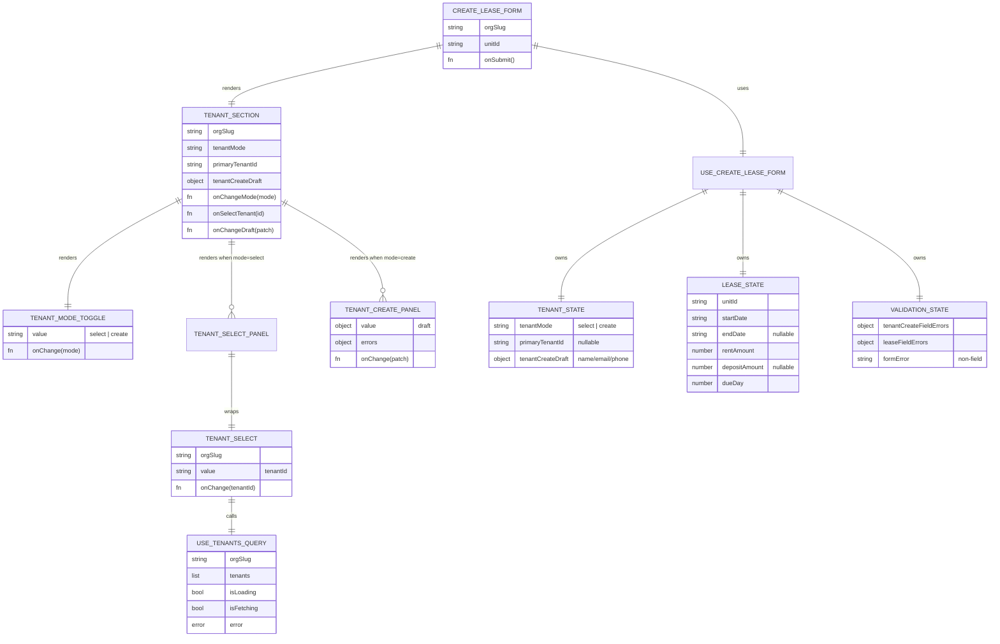
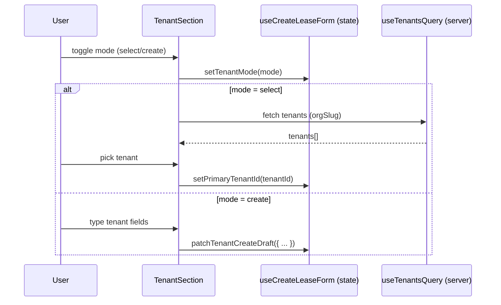
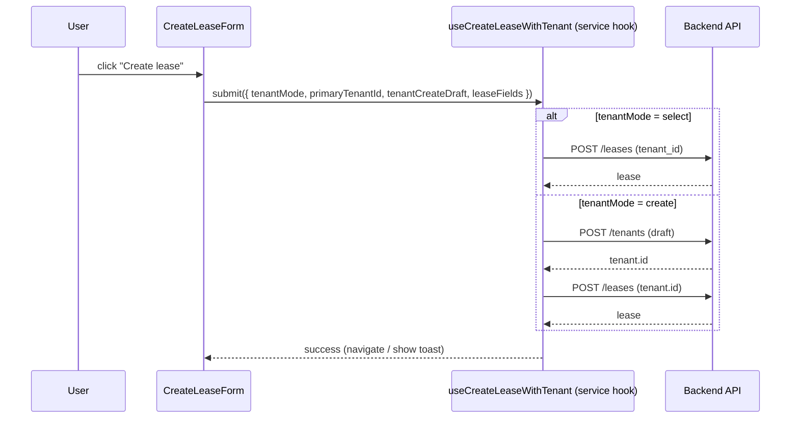

# TenantSection Orchestration (Entity-Style Diagram)

EstateIQ — Create Lease Flow (Tenant selection + inline tenant create)

---

## What this module does

`TenantSection` is the **tenant selection boundary** inside `CreateLeaseForm`.

It supports:

- **Select existing tenant** (pick a tenant already in the org)
- **Create new tenant inline** (enter draft info, later orchestrated into a create-then-lease flow)

**Rule:** UI components never sequence API calls. Sequencing lives in a hook/service.

---

## Component Entities (ER-style)

> Think of each component like an “entity”: it has **inputs (props)**, **outputs (events)**, and **owned state (if any)**.

---

## Responsibility Boundaries (who owns what)

### `CreateLeaseForm` (orchestrator of the whole lease workflow)
Owns:

- the **submit button**
- the **lease mutation**
- error mapping (API → field errors)
- the *future* “create tenant then create lease” sequencing

Does **not**:
- render tenant inputs directly (delegates to `TenantSection`)

### `TenantSection` (tenant UI orchestrator)
Owns:

- mode switching UI
- choosing which panel to render
- pushing events upward (`onSelectTenant`, `onChangeDraft`, `onChangeMode`)

Does **not**:
- call APIs
- create tenants
- create leases

### Panels (presentational + small glue)
- `TenantModeToggle`: pure UI
- `TenantSelectPanel` / `TenantSelect`: fetch + select behavior (org scoped)
- `TenantCreatePanel`: draft field UI + error display

---

## Data flow: selection + draft updates

---

## Submit orchestration (Phase B: create-then-lease)

Right now, your UI is set up for this cleanly.

When you implement `useCreateLeaseWithTenant()`, the submit sequence becomes:

**Key point:** `TenantSection` stays ignorant of sequencing.

---

## Why this is “enterprise-grade”

- **Deterministic orchestration:** submit sequencing is centralized in a service hook.
- **Hard presentation boundary:** tenant UI cannot accidentally create records.
- **Multi-tenant safe by design:** tenant queries require `orgSlug`, and mutations are executed only at the form boundary.
- **Testability:** you can unit-test orchestration without rendering UI.

---

## Testing targets

### Unit tests (most valuable)
- `useCreateLeaseForm`: validation + payload building
- `useCreateLeaseWithTenant`: sequencing rules + error handling

### Component tests
- `TenantSection` switches panels correctly
- `TenantCreatePanel` displays field errors
- `TenantSelect` shows loading / empty states

---

## Extension roadmap

- tenant autocomplete (debounced search)
- duplicate detection (email/phone)
- “Create tenant” modal variant (swap UI only)
- multi-party leases (add co-tenant selection)

---

## Architectural mantra

**TenantSection is a presentation boundary.**  
**CreateLeaseForm owns sequencing.**  
**Ledger correctness stays deterministic elsewhere.**
